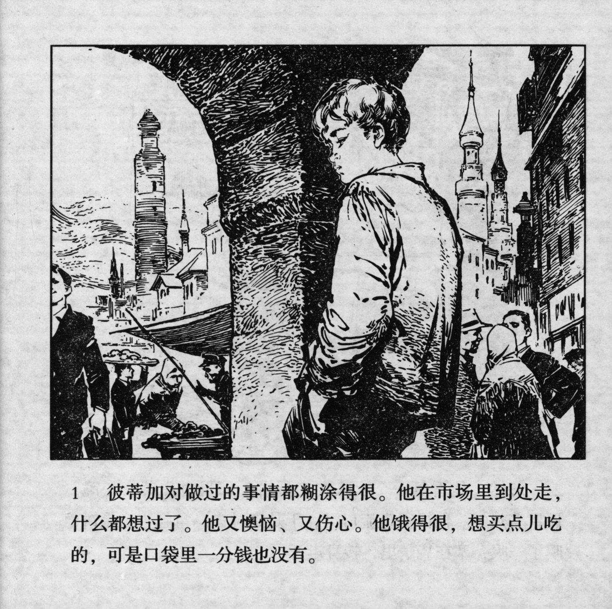



彼蒂加对做过的事情都糊涂得很。他在市场里到处走，什么都想过了。他又懊恼、又伤心。他饿得很，想买点儿吃的，可是口袋里一分钱也没有。

<--->

Petka was confused about the things he had done. He walked around the marketplace thinking about all sorts of things. He was frustrated and sad. He was terribly hungry and wanted to buy something to eat, but he did not have any money in his pocket.


