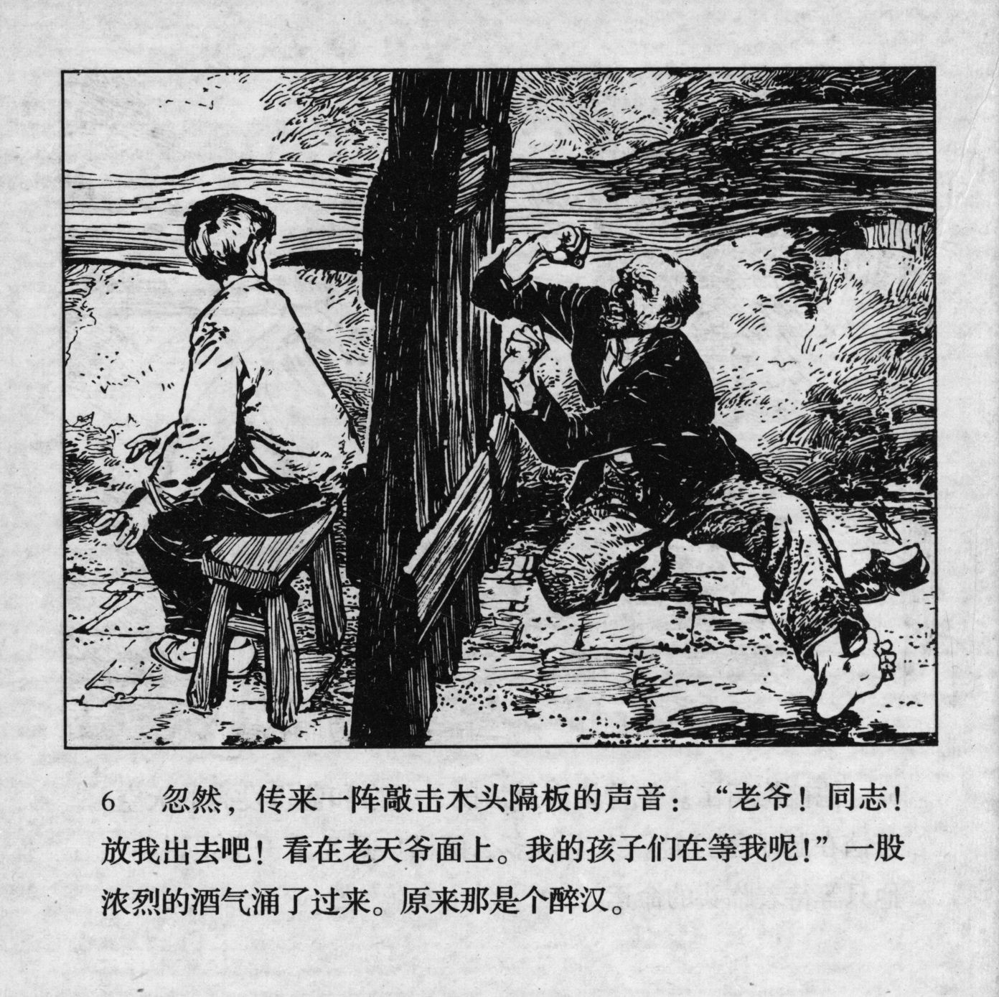



忽然，传来一阵敲击木头隔板的声音：“老爷！同志！放我出去吧！看在老天爷面上！我的孩子们在等我呢！”一股浓烈的酒气涌了过来。原来那是个醉汉。

<--->

Suddenly, he noticed a tapping sound on the wooden wall: "Masters! Comrades! Let me out! In the name of God! My children are waiting for me!" A wave of boozy breath came over. It turned out to be a drunkard.


