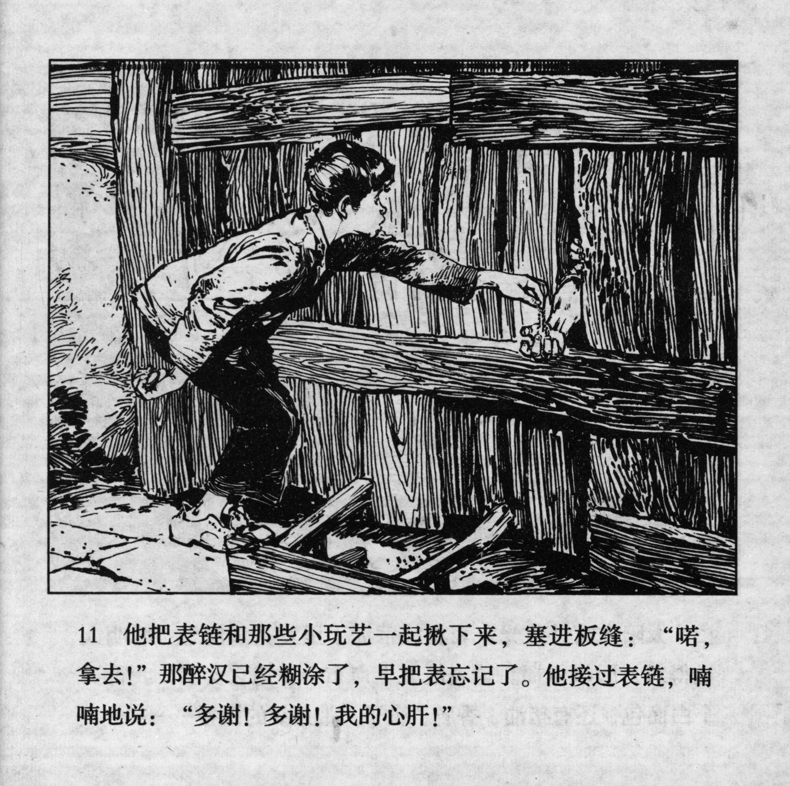



他把表链和那些小玩艺一起揪下来，塞进板缝：“喏，拿去！”那醉汉已经糊涂了，早把表忘记了。他接过表链，喃喃地说：“多谢！多谢！我的心肝！”

<--->

He pulled off the chain with the charms and stuffed it through the gap: "Here, take it!" The drunkard was muddle-headed. He had already forgotten about the watch. He took the chain and murmured: "Thanks a lot! Thanks a lot! My precious!"


