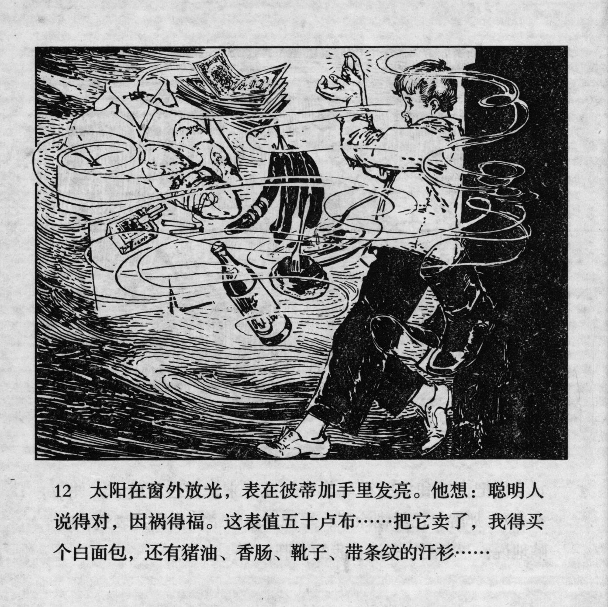



太阳在窗外放光，表在彼蒂加手里发亮。他想：聪明人说得对，因祸得福。这表值五十卢布……把它卖了，我得买个白面包，还有猪油、香肠、靴子、带条纹的汗衫……

<--->

The sun was shining outside the window, and the watch was gleaming in Petka's hand. He thought: "The wise man was right about gaining profit by misfortune. This watch is worth 50 Roubles… after selling it, I'll buy myself white bread and lard, sausages, boots, and also a striped undershirt…"


