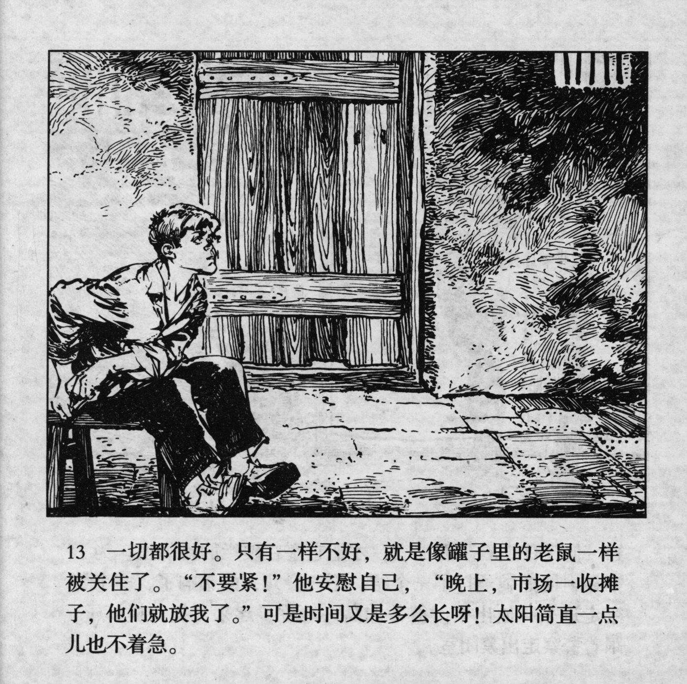



一切都很好。只有一样不好，就是像罐子里的老鼠一样被关住了。“不要紧！”他安慰自己，“晚上，市场一收摊子，他们就放我了。”可是时间又是多么长呀！太阳简直一点儿也不着急。

<--->

Everything was fine. Only one thing was not fine, to be locked up like a mouse in a jar. "Never mind!" He comforted himself, "in the evening, once the market closes, they will let me go." But how slowly the time passed! The sun was not in a hurry at all.


