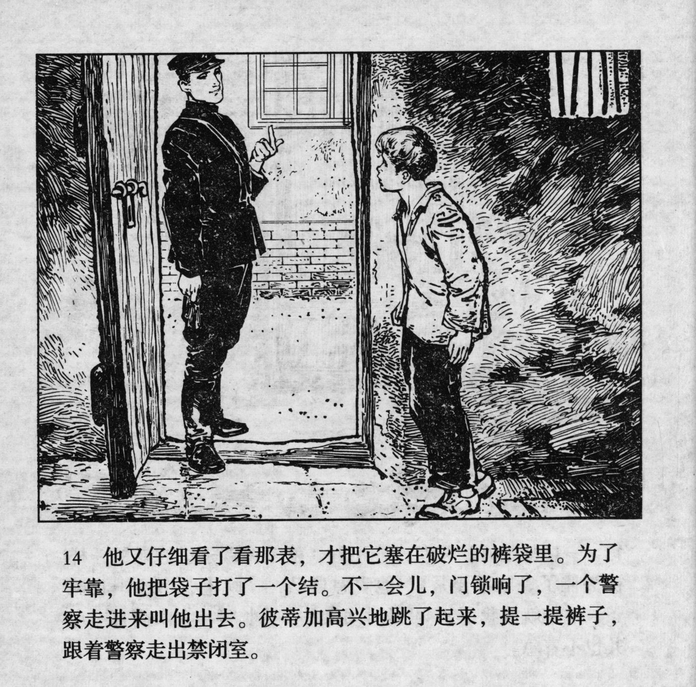



他又仔细看了看那表，才把它塞在破烂的裤袋里。为了牢靠，他把袋子打了一个结。不一会儿，们锁响了，一个警察走进来叫他出去。彼蒂加高兴地跳了起来，提一提裤子，跟着警察走出禁闭室。

<--->

Carefully, he looked at the watch and put it into the pocket of his tattered trousers. Just in case, he tied the pocket with a knot. After a while, the door opened, a policeman walked in and called him out. Rejoicing, Petka jumped up, pulled up his pants and followed the policeman out of the guardroom.


