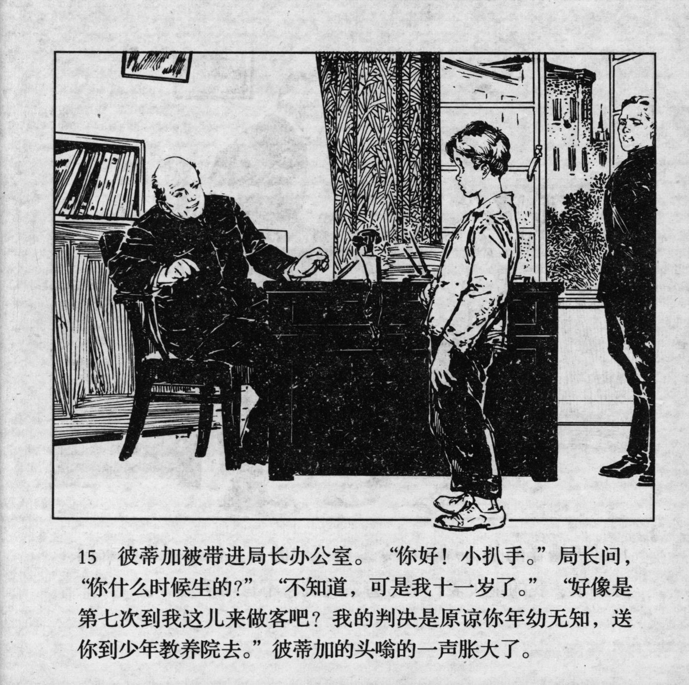



彼蒂加被带进局长办公室。“你好！小扒手。”局长问，“你什么时候生的？”“不知道，可是我十一岁了。”“好像是第七次到我这儿来做客吧？我的判决是原谅你年幼无知，送你到少年教养院去。”彼帝加的头嗡的一声胀大了。

<--->

Petka was taken into the chief\'s office. "Hello, little pickpocket! When were you born?" The chief asked. "I don't know, but I am eleven years old." - "You seem to be my guest for the seventh time? My decision is to forgive you your youth and ignorance, and send you to the reformatory." Petka's head started to buzz.


