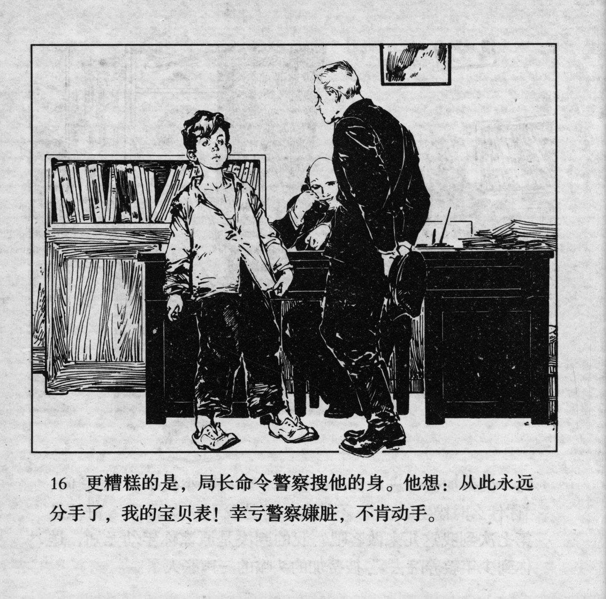



更糟糕的是，局长命令警察搜他的身。他想：从此永远分手了，我的宝贝表！幸亏警察嫌脏，不肯动手。

<--->

To make matters worse, the chief ordered the policeman to search his body. He thought: "Farewell forever, my beloved watch." Fortunately, the policeman disliked filth and was unwilling to move.


