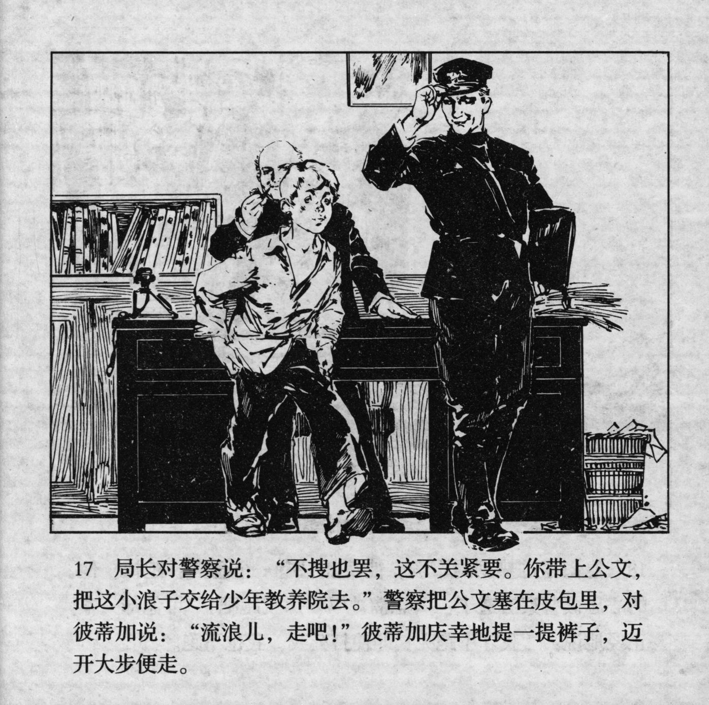



局长对警察说：“不搜也罢，这不关紧要。你带上公文，把这小浪子交给少年教养院去。”警察把公文塞在皮包里，对彼蒂加说：“流浪儿，走吧！”彼蒂加庆幸地一提裤子，迈开大步便走。

<--->

The chief said to the policeman: "Don't search, it doesn\'t matter. Take this document and bring this little hooligan to the reformatory." The policeman stuffed the document into his briefcase and turned to Petka: "Hooligan, let\'s go!" Happily, Petka pulled up his pants and followed with big steps.


