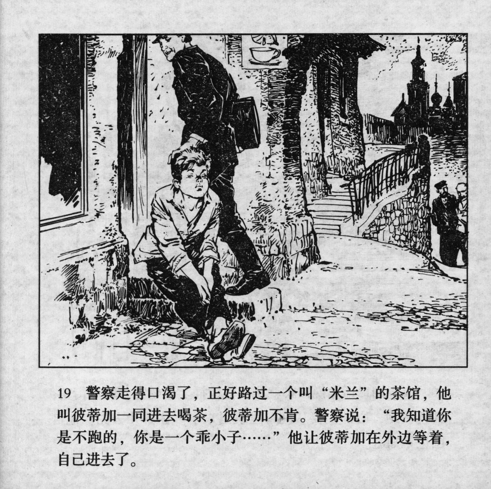



警察走得口渴了，正好跟过一个叫“米兰”的茶馆，他叫彼蒂加一同进去喝茶，彼蒂加不肯。警察说：“我知道你是不跑的，你是一个乖小子……”他让彼蒂加在外边等着，自己进去了。

<--->

The policeman walked and became thirsty, just as they passed by a teahouse called "Milan". He asked Petka to go in together to drink some tea, but Petka refused. The policeman said: "I know you won't run away. You're a good boy…" He left Petka waiting outside and went in by himself.


