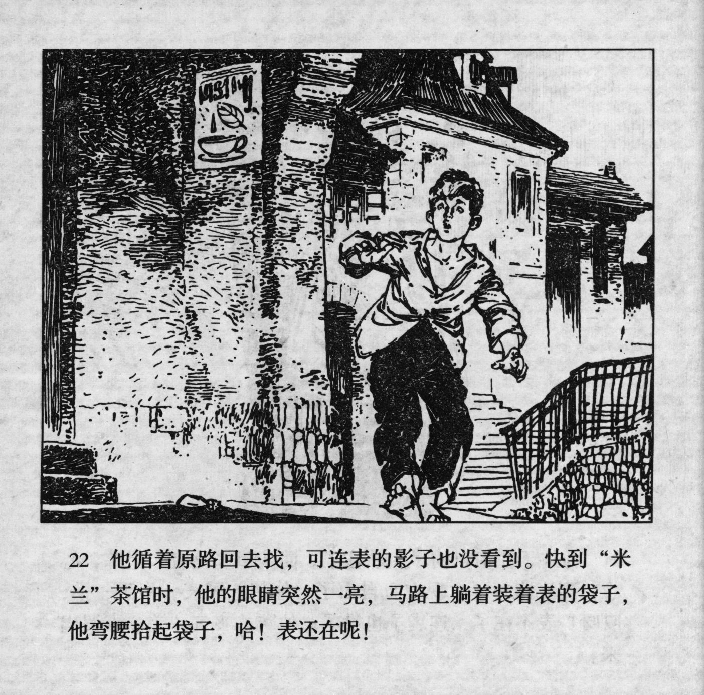



他循着原路回去找，可连表的影子也没看到。快到“米兰”茶馆时，他的眼睛突然一亮，马路上躺着装着表的袋子，他弯腰拾起袋子，哈! 表还在呢!

<--->

He went back the same way, but he did not even see a shadow of his watch. When he had almost reached the "Milan" teahouse, his eyes suddenly brightened, as he saw the pocket with the watch in it. He bent down to pick it up. HA! The watch was still there!


