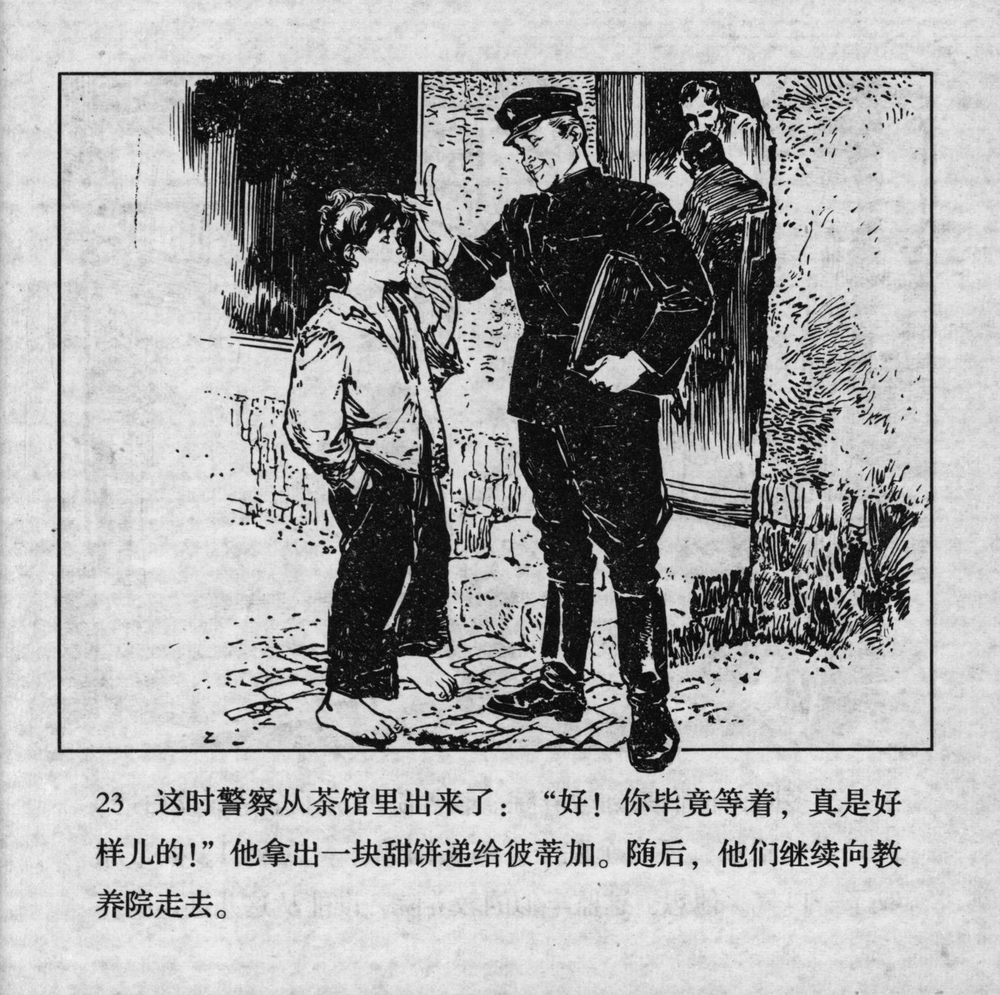



这时警察从茶馆里出来了：“好！你毕竟等着，真是好样儿的！”他拿出一块甜饼递给彼蒂加。随后，他们继续向教养院走去。

<--->

Right at that moment, the policeman stepped out of the teahouse: "Good! You've waited after all. What a good boy!" He took out a piece of sweet cake and handed it to Petka. After this, they continued their walk to the reformatory.


