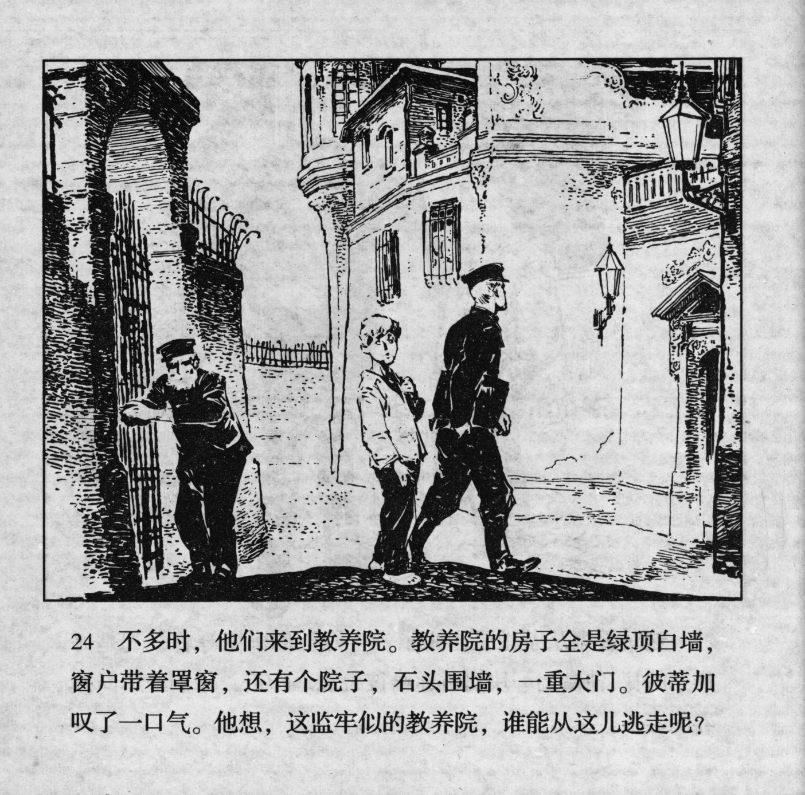



不多时，他们来到教养院。教养院的房子全是绿顶白墙，窗户带着罩窗，还有个院子，右头围墙，一重大门。彼蒂加叹了一口气。他想，这监牢似的教养院，谁能从这儿逃走呢?

<--->

Before long, they arrived at the reformatory. The building of the reformatory had a green roof and white walls. The windows had curtains and there was a yard. On the right side of the fence, there was a heavy gate. Petka sighed. He thought: "This reformatory is like a prison, who can escape from here?"


