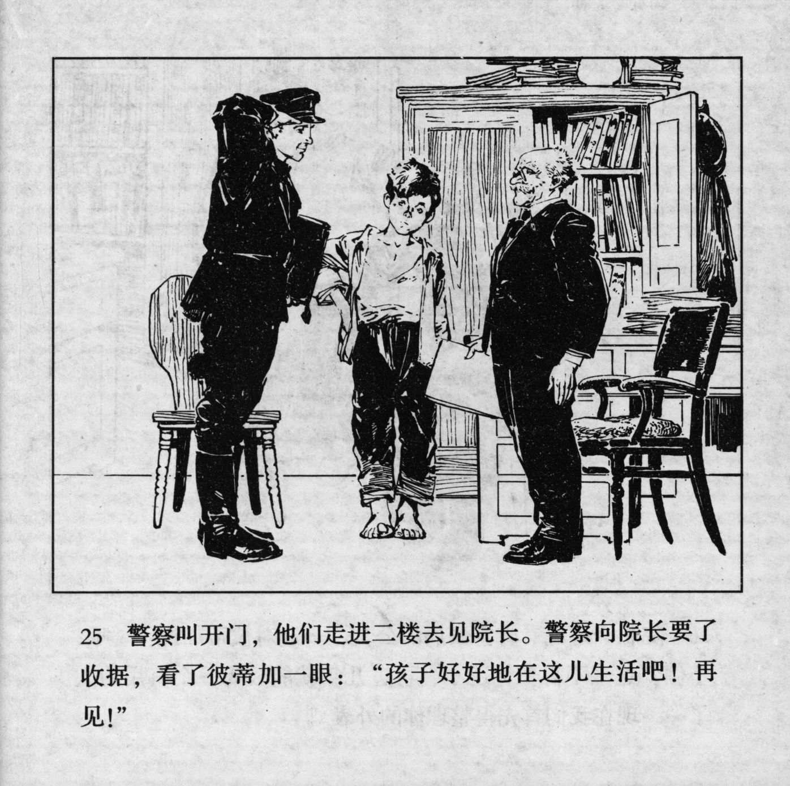



警察叫开门，他们走进二楼去见院长。警察向院长要了收据，看了彼蒂加一眼：“孩子好好地在这儿生活吧！再见!”

<--->

The policeman called to open the door and they went to the second floor to see the director. The policeman requested for a receipt from the director and glanced at Petka: "Child, live well here! Goodbye!"


