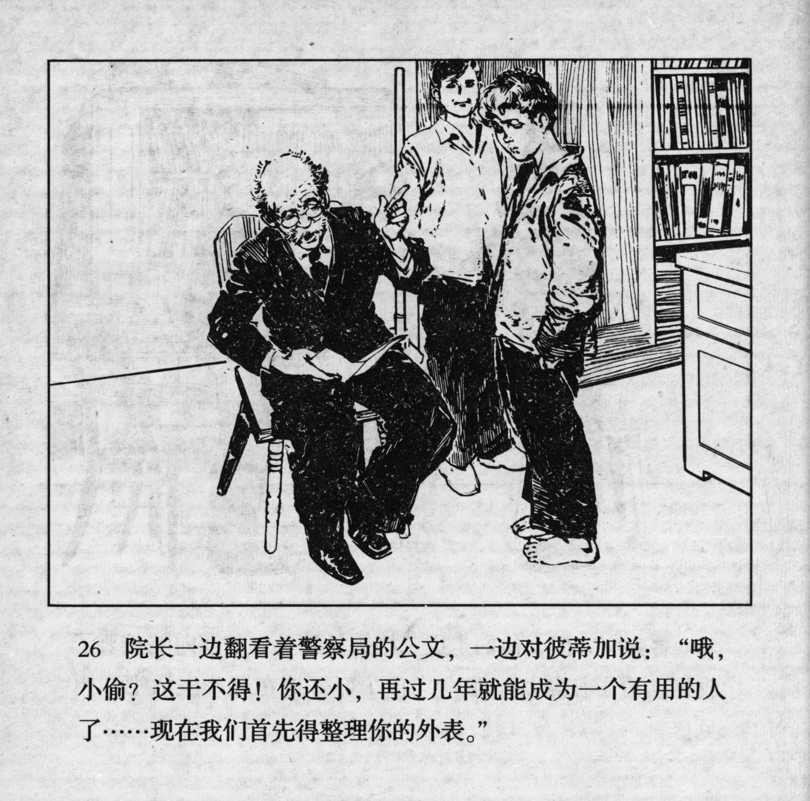



院长一边翻看着警察局的公文，一边对彼蒂加说：“哦，小偷？这干不得！你这小，再边几年就能成为一个有用的人了……现在我们首先得整理你的外表。”

<--->

While the director looked through the police documents, he turned to Petka: "Oh, a thief? This can't be! You're still young, in a few years, you can turn into a useful person... now, we first have to put your appearance in order."


