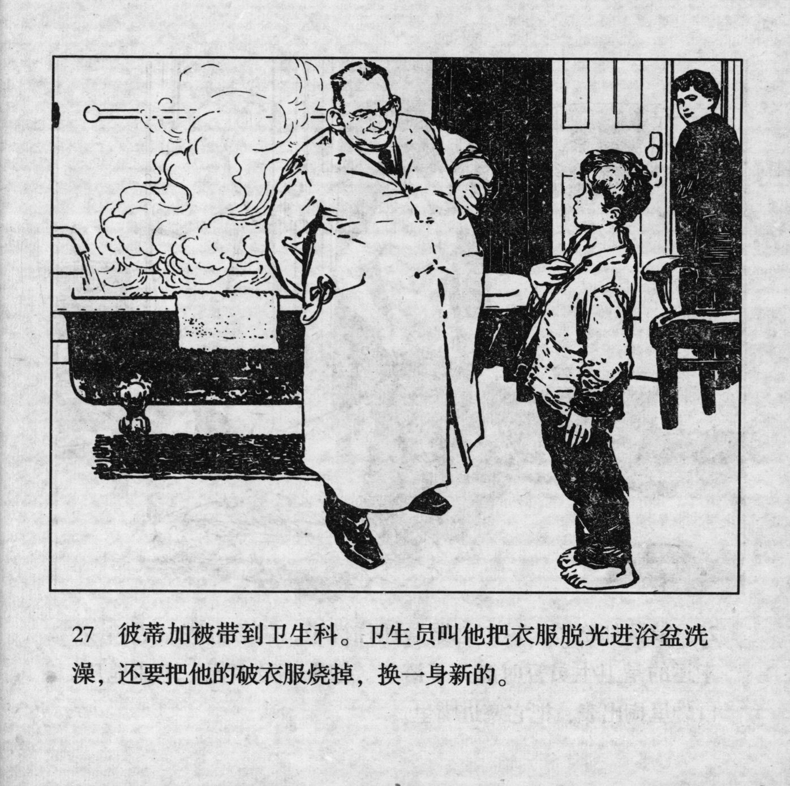



彼蒂加被带到卫生科。卫生员叫他把衣服脱光进浴盆洗澡，还要把他的破衣服烧掉，换一身新的。

<--->

Petka was taken to the infirmary. The health worker told him to take off all his clothes, to take a bath in the bathtub and to burn his worn-out clothes in exchange for a set of new ones.


