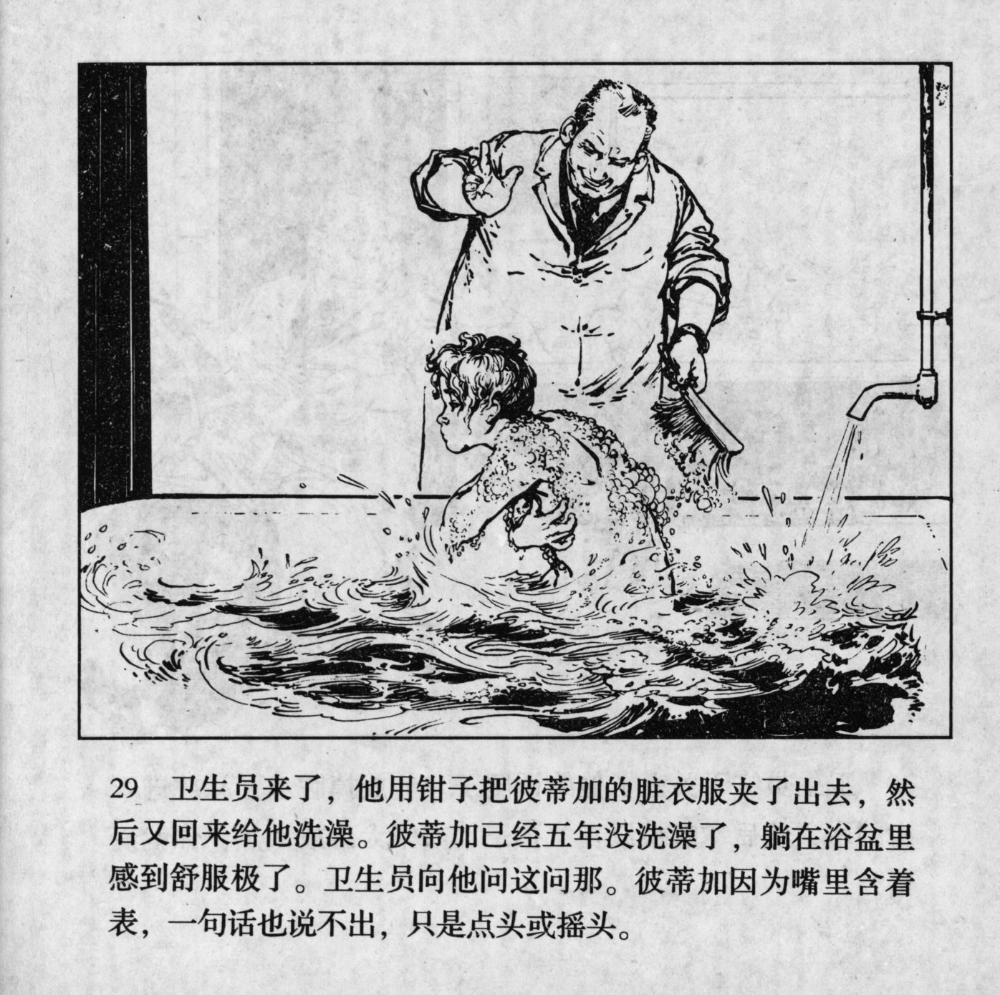



卫生员来了，他用钳子把彼蒂加的脏衣服夹了出来，然后又回来给他洗澡。彼蒂加已经五年没洗澡了，躺在浴盆里感到舒服极了。卫生员问他问这问那。彼蒂加因为嘴里含着表，一句话也说不出，只是点头或摇头。

<--->

The health worker came back. He carried Petka's clothes outside with pliers, then returned to give him a bath. Petka had not taken a bath in five years, so when he lay in the bathtub, it felt really comfortable. The health worker asked a stream of questions. But because Petka had the watch in his mouth, he could not say a word, he just nodded or shook his head.


