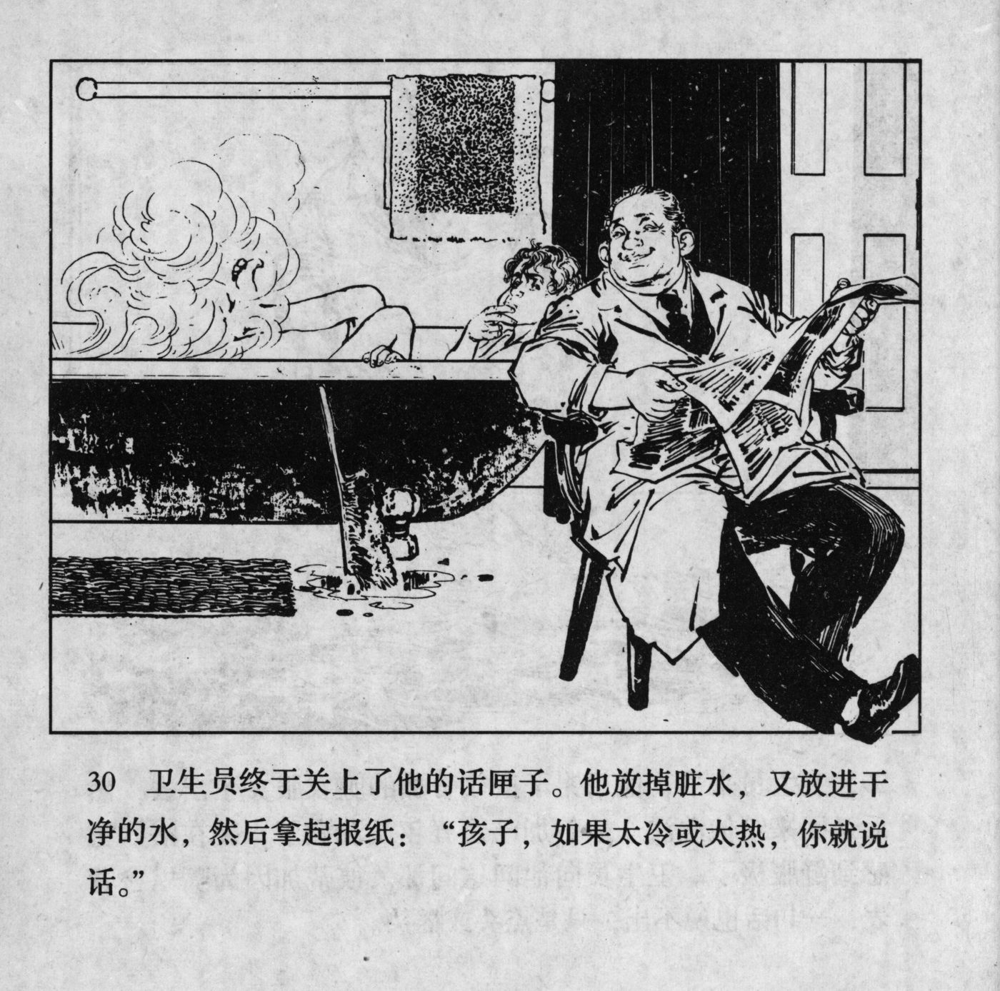



卫生员终于关上了他的话匣子。他放掉脏水，又放进干净的水，然后拿起报纸：“孩子，如果太冷或太热，你就说话。”

<--->

The health worker finally turned off his chatterbox. He let the dirty water out, and filled it up with clean water, then he took the newspapers: "Kid, if it's too cold or too hot, just tell me."


