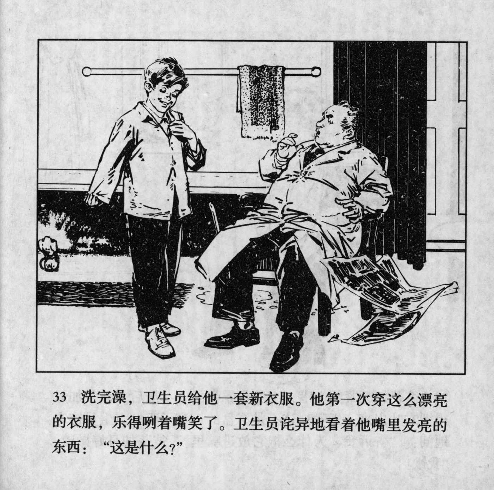

 



洗完澡，卫生员给他一套新衣服。他第一次穿这么漂亮的衣服，乐得咧着嘴笑了。卫生员诧导地看着他嘴里发亮的东西：“这是什么？”

<--->

When he was done bathing, the health worker gave him a set of new clothes. It was the first time for him to wear such pretty clothes, so he grinned with his mouth wide open. The health worker was surprised to see something shiny in his mouth: "What is this?"


