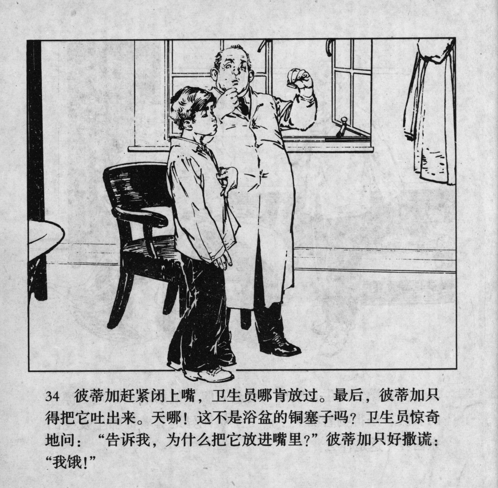



彼蒂加赶紧闭上嘴，卫生员哪肯放过。最后，彼蒂加只得把它吐出来。天啊！这不是浴盆的铜塞子吗？卫生员惊奇地问：“告诉我，为什么把它放进嘴里？”彼蒂加只好撤谎：“我饿！”

<--->

Petka hastily closed his mouth, but the health worker would not let go. In the end, Petka had to spit it out. Good heavens! Was this not the copper plug of the bathtub? The health worker was surprised: "Tell me, why did you put that into your mouth?" Petka had to lie: "I'm hungry!"


