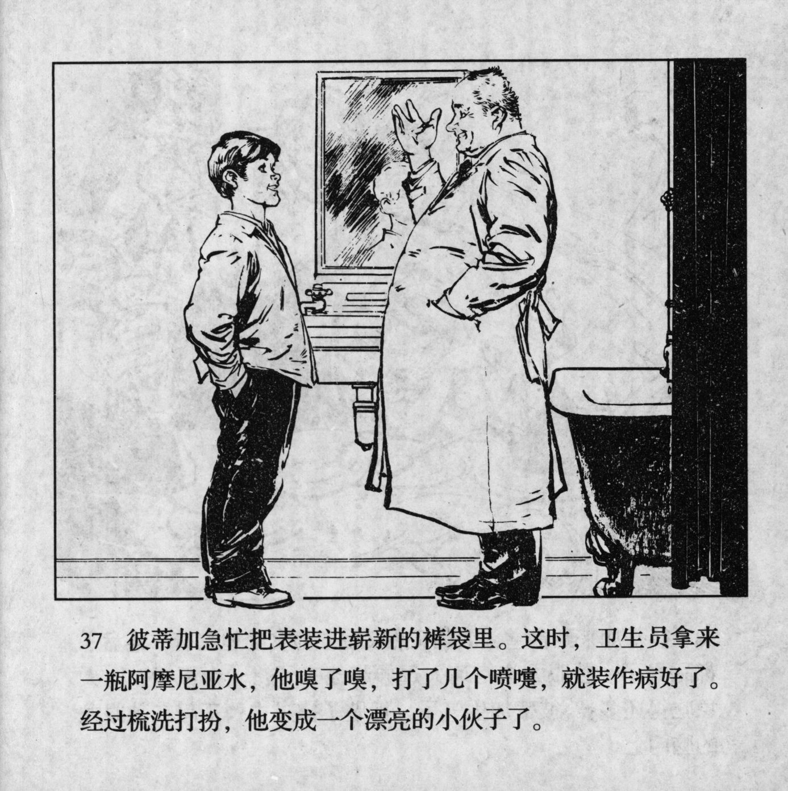



彼蒂加急忙把表装进崭新的裤袋里。这时，卫生员拿来一瓶阿摩尼亚水，他嗅了嗅，打了几个喷嚏，就装作病好了。经过梳洗打扮，他变成一个漂亮的小伙子了。

<--->

Petka hastily put the watch into the pocket of his brand-new pants. Right then, the health worker brought a bottle of ammonia solution. Petka sniffed it, sneezed a few times, and then pretended to be cured. Now that he had freshened up, he turned into a pretty young lad.


