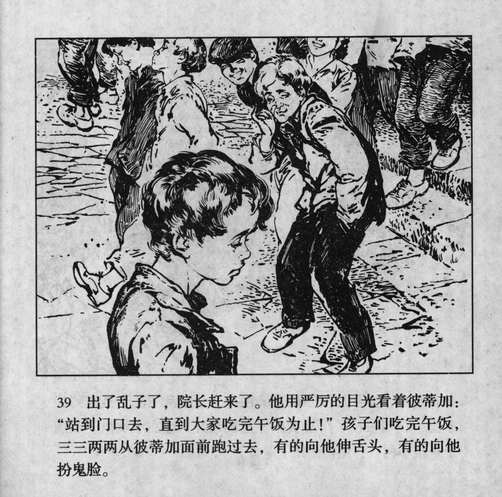



出了乱子了，院长赶来了。他用严厉的目光看着彼蒂加：“站到门口去，直到大家吃完午饭为止！”孩子们吃完午饭，三三两两从彼蒂加面前跑过去，有的向他伸舌头，有的向他扮鬼脸。

<--->

Upon the commotion, the director rushed in. He gave Petka a stern look: "Stand in the doorway until everybody has finished their lunch!" After the children had finished their lunch, they ran past Petka in groups of twos and threes, some of them sticking out their tongues, some of them making faces at him.


