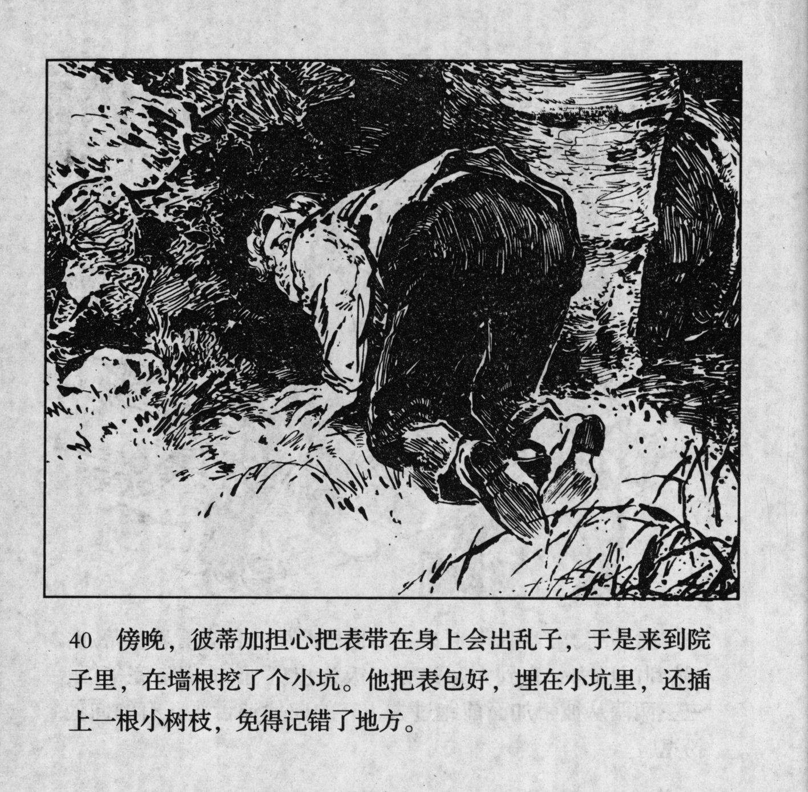



傍晚，彼蒂加担心把表带在身上会出乱子，于是来到院子里，在墙根挖了个小坑。他把表包好，埋在小坑里，还插上一根小树枝，免得记错了地方。

<--->

At dusk, Petka worried that keeping the watch on him might cause trouble, so he went to the yard and dug a small hole at the foot of a wall. He wrapped up the watch, buried it and stuck a small twiglet on it in order not to remember the wrong spot.


