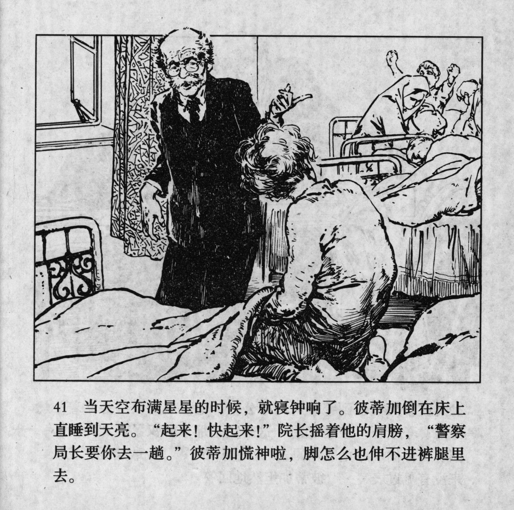



当天空布满星星的时候，就寝钟响了。彼蒂加倒在床上直睡到天亮。“起来！快起来！”院长摇着他的肩膀，“警察局长要你去一趟。”彼蒂加慌神啦，脚怎么也伸不进裤脚里去。

<--->

When the sky was full of stars, the bell rang. Petka fell into bed and slept till dawn. "Get up! Get up!" The director shook his shoulder. "The chief wants you to come." Petka panicked and could not get his feet into his trousers no matter how hard he tried.


