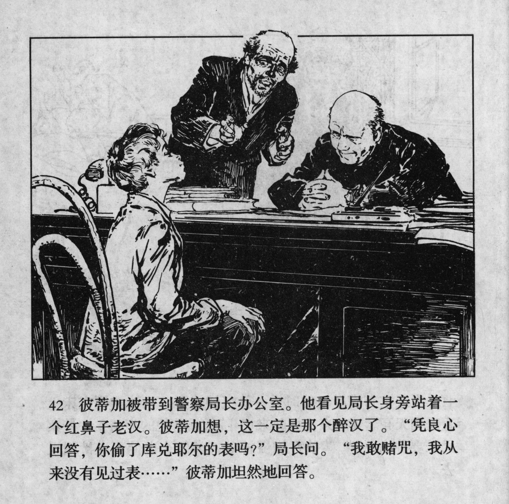



彼蒂加被带到警察局长办公室。他看见局长身旁站着一个红鼻子老汉。彼蒂加想，这一定是那个醉汉了。“凭良心回答，你偷了库兑耶尔的表吗？”局长问。“我敢赌咒，我从来没有见过表……”彼蒂加坦然地回答。

<--->

Petka was taken to the chief's office. He saw an old, red-nosed man standing next to the chief. Petka thought this was for sure the drunkard. "Answer honestly, did you steal Kudeyar's watch?'' the chief asked. "I swear, I\'ve never seen that watch...'', Petka answered calmly.

s
