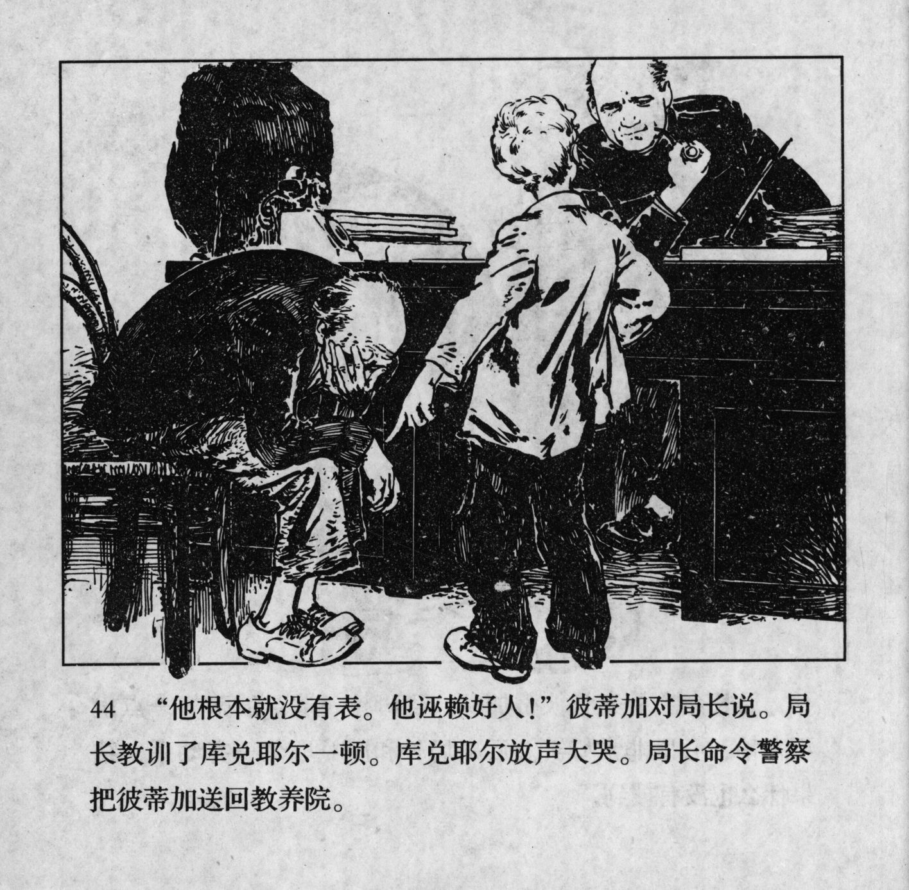



“他根本就没有表。他诬赖好人！”彼蒂加对局长说。局长教训了库兑耶尔一顿。库兑耶尔放声大哭。局长命令警察把彼蒂加送回教养院。

<--->

"He doesn't even own a watch, he's accusing innocent people!" Petka said to the chief. The chief read Kudeyar the riot act. Kudeyar began to cry loudly. The chief ordered the policeman to take Petka back to the reformatory.


