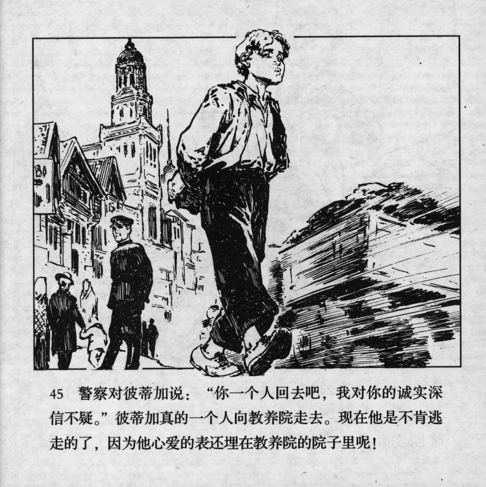



警察对彼蒂加说：“你一个人回去吧，我对你的诚实深信不疑。”彼蒂加真的一个人向教养院走去。现在他是不肯逃走的了，因为他心爱的表还埋在教养院的院子里呢！

<--->

The policeman said to Petka: "Go back by yourself, you are an honest boy.'' And Petka indeed started to walk back to the reformatory. He did not want to run away now because his beloved watch was still buried in the yard of the reformatory!


