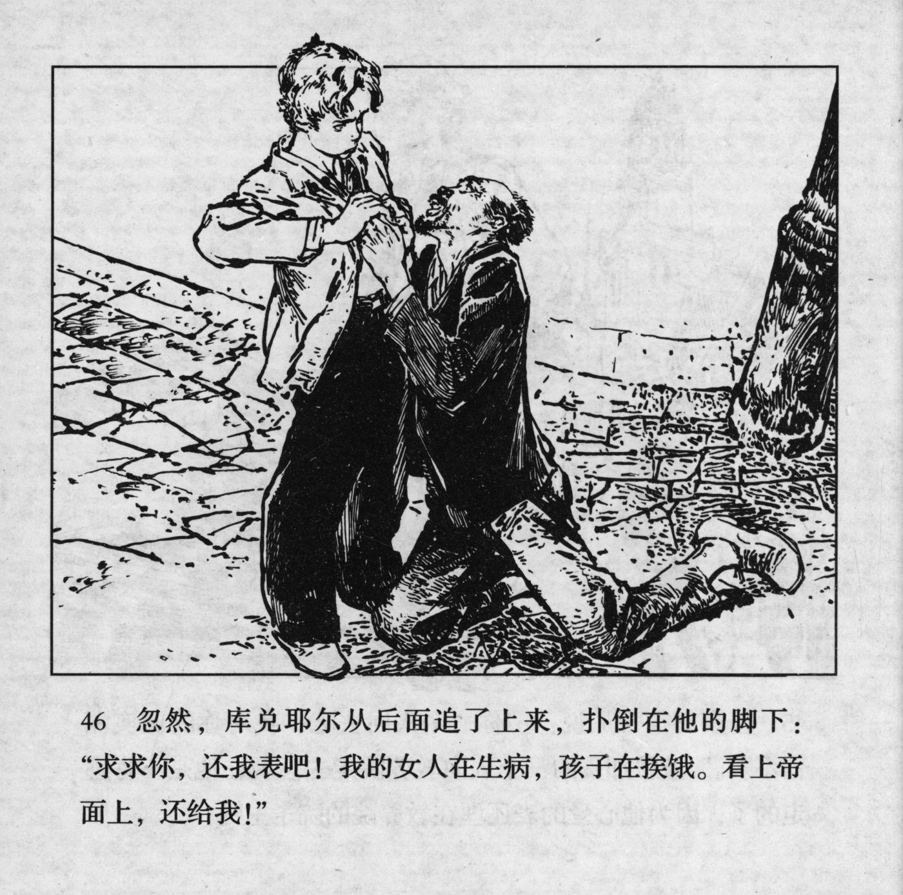



忽然，库兑耶尔从后面追了上来，扑倒在他的脚上：“求求你，还我表吧！我的女人在生病，孩子在挨饿。看上帝面上，还给我！”

<--->

Suddenly, Kudeyar caught up with him and threw himself at his feet: "I beg you, give me back my watch! My wife is sick, the children are starving. In the name of God, give it back to me!"


