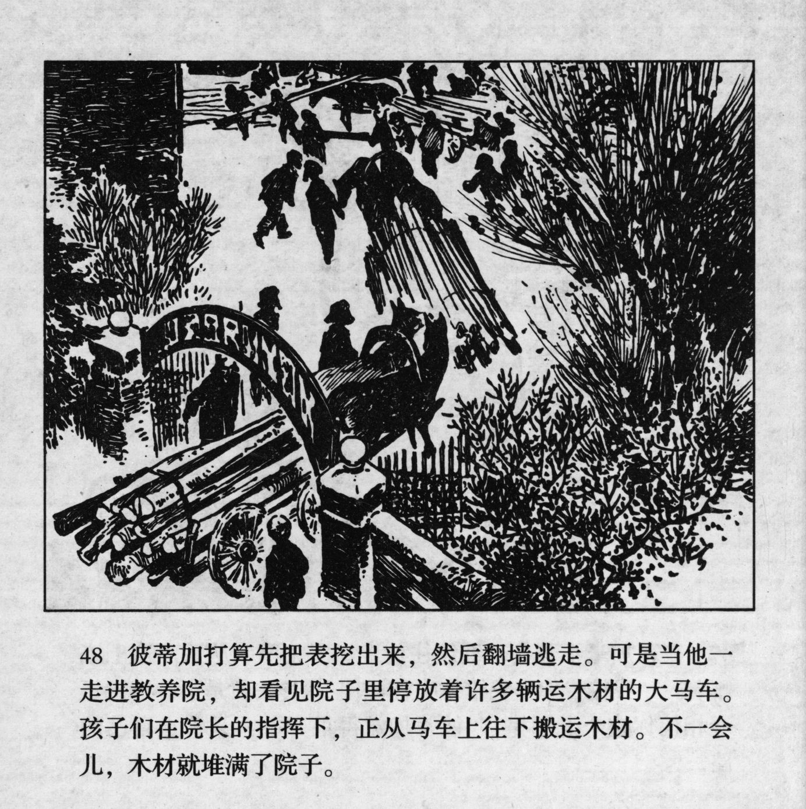



彼蒂加打算先把表挖出来，然后翻墙逃走。可是当他一走进教养院，却看见院子里停放着许多辆运木材的大马车。孩子们在院长的指挥下，正从马车上往下搬运木材。不一会儿，木材就堆满了院子。

<--->

Petka came up with a plan. He would first dig out the watch, and then climb over the wall and run away. However, when he arrived at the reformatory, he saw that numerous horse carriages loaded with timber were parked in the courtyard. Under the command of the director, the children unloaded the logs from the carriages. Before long, the courtyard was all filled with timber.


