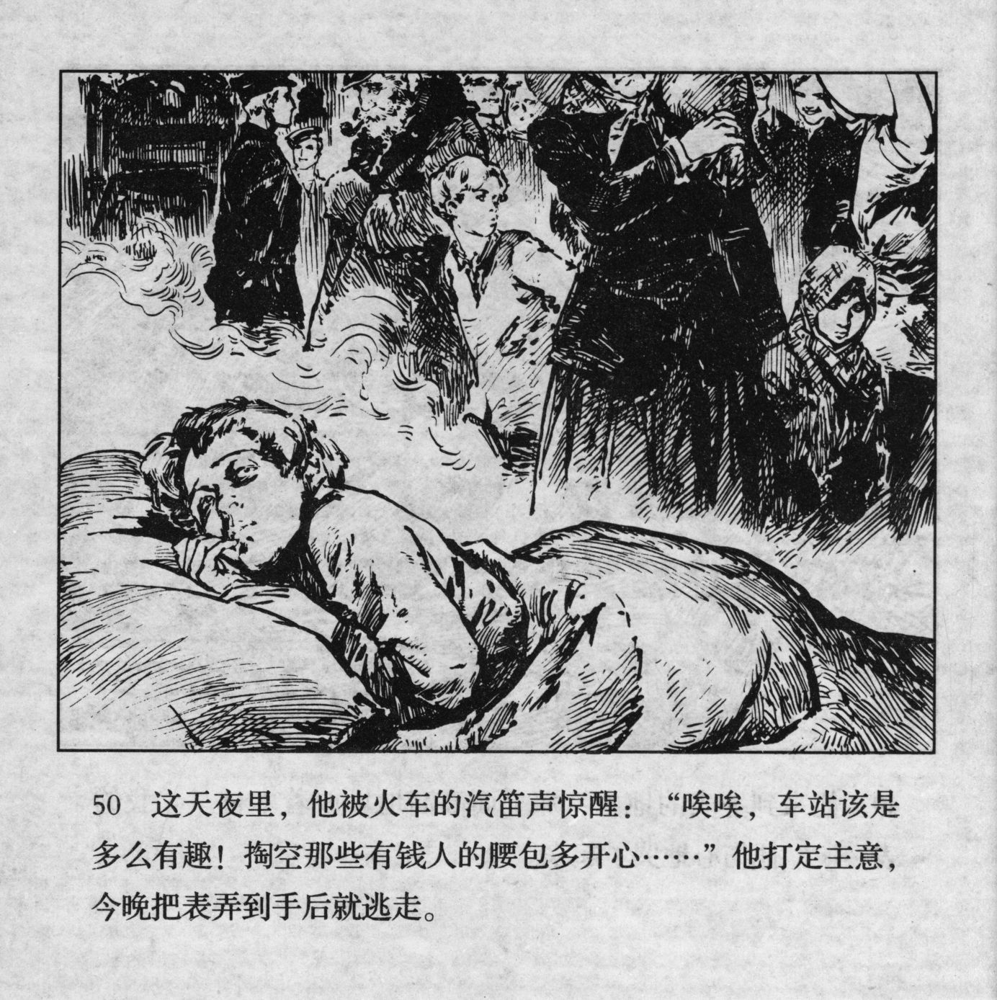



这天夜里，他被火车的汽笛声惊醒：“唉唉，车站该是多么有趣！掏空那些有钱人的腰包多开心……”他打定主意，今晚把表弄到手后就逃走。

<--->

At night, the sound of a train whistle woke him up. "Oh, how much fun it would be to be at the station and empty out the pockets of all those rich people..." He made up his mind: Tonight, he would get the watch into his hands and just run away.


