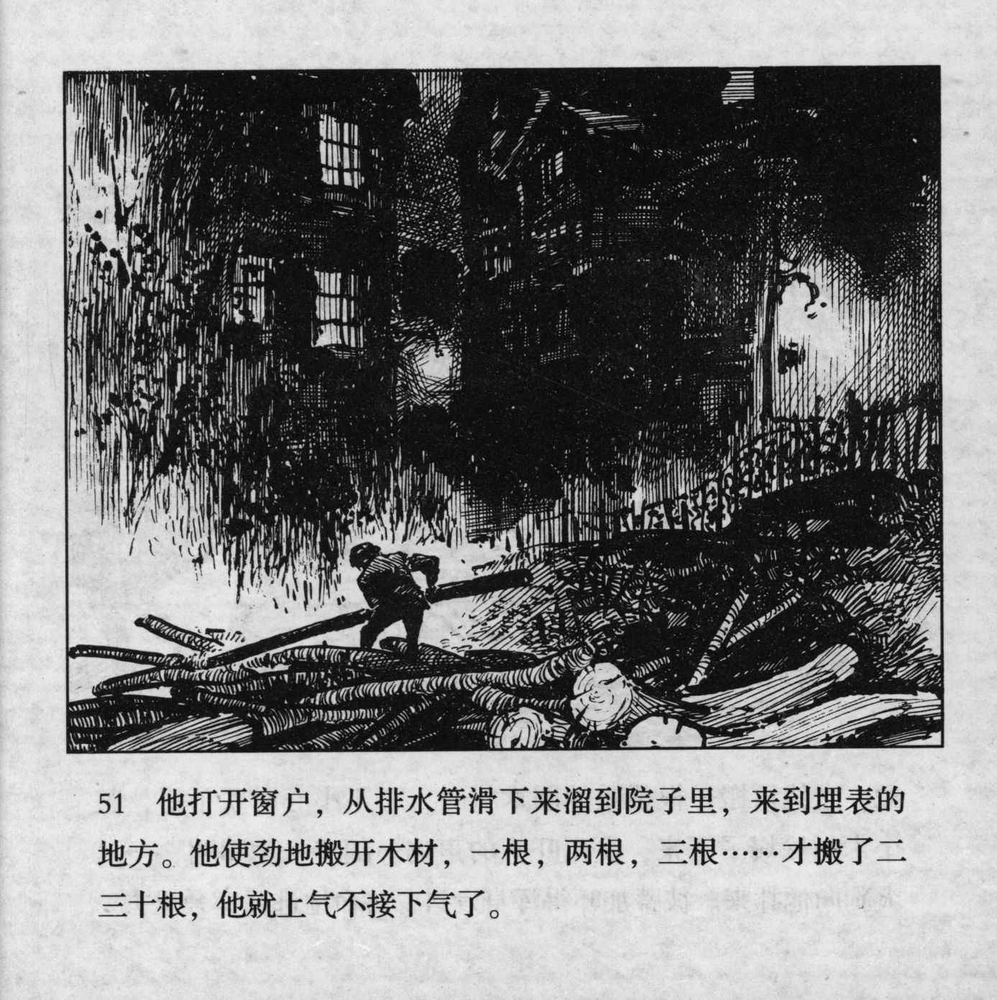



他打开窗户，从排水管滑下来溜到院子里，来到埋表的地方。他使劲地搬开木材，一根，两根，三根……才搬了二三十根，他就上气不接下气了。

<--->

He opened the window, glided down the drainpipe, landed in the courtyard, and went to the place where his watch was buried. With all his strength he dragged away the logs. One log, two logs, three logs\... when he had dragged away only twenty or thirty logs, he was gasping for air already.


