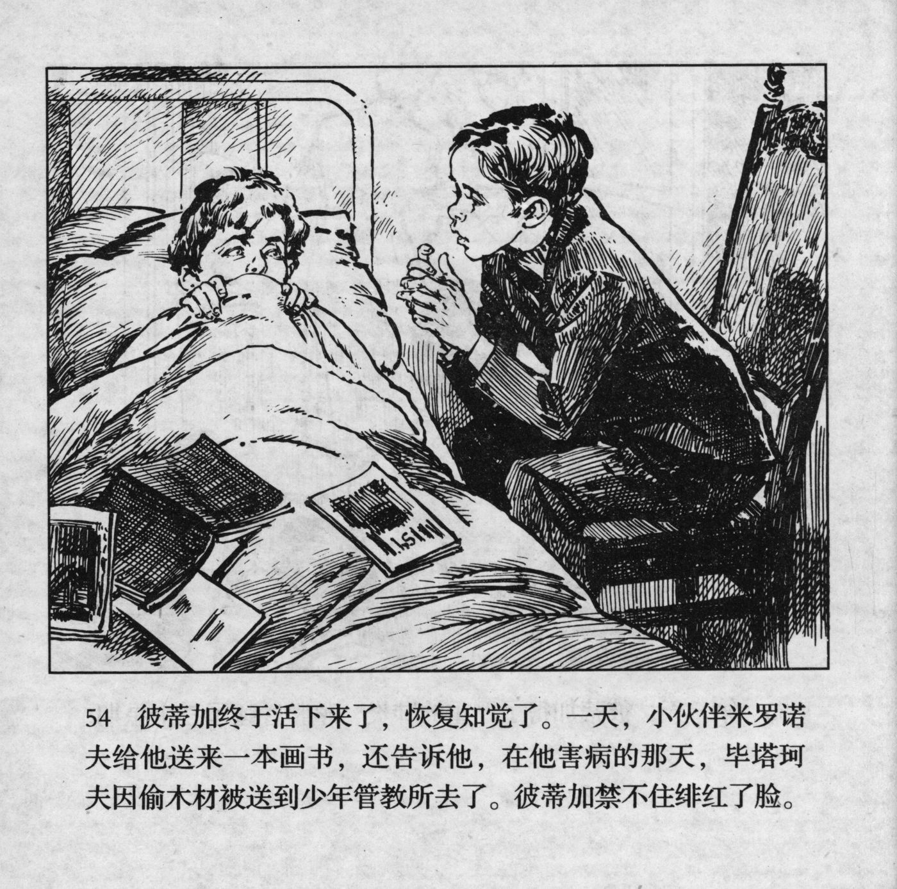



彼蒂加终于活下来了，恢复知觉了。一天，小伙伴米罗诺夫给他送来一本画书，还告诉他，在他害病的那天，毕塔珂夫因偷木材被送到少年管教所去了。彼蒂加禁不住绯红了脸。

<--->

Petka finally started to get better and recovered his consciousness. One day, his mate Milonov brought him a picture book. He told him that Pyatakov had been sent to the youth custody centre for stealing wood on the same day that Petka had fallen ill. Petka could not help but blush.


