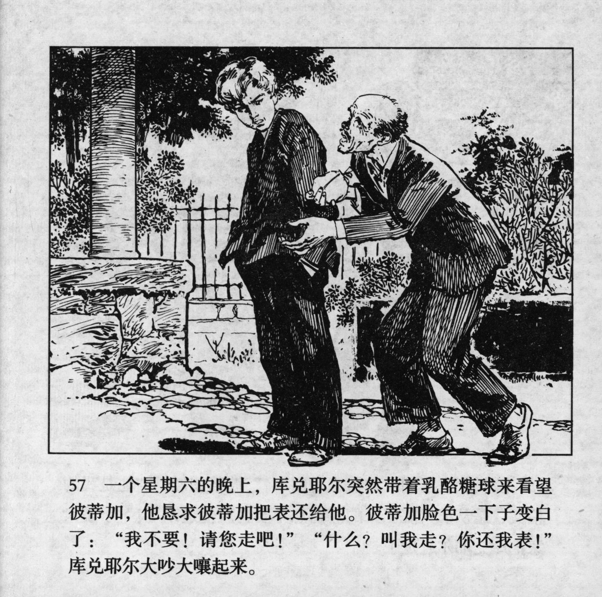



一个星期六的晚上，库兑耶尔突然带着乳酪糖球来看望彼蒂加，他恳求彼蒂加把表还给他。彼蒂加脸色一下子变白了：“我不要！请您走吧！”“什么？叫我走？你还我表！”库兑耶尔大吵大嚷起来。

<--->

One Saturday evening, Kudeyar suddenly came to pay Petka a visit, bringing toffees and begging him to return his watch. Petka's face instantly turned white: "No! I ask you to leave!" -- "What? You tell me to go? Give me back my watch!" Kudeyar started to make a big scene.


