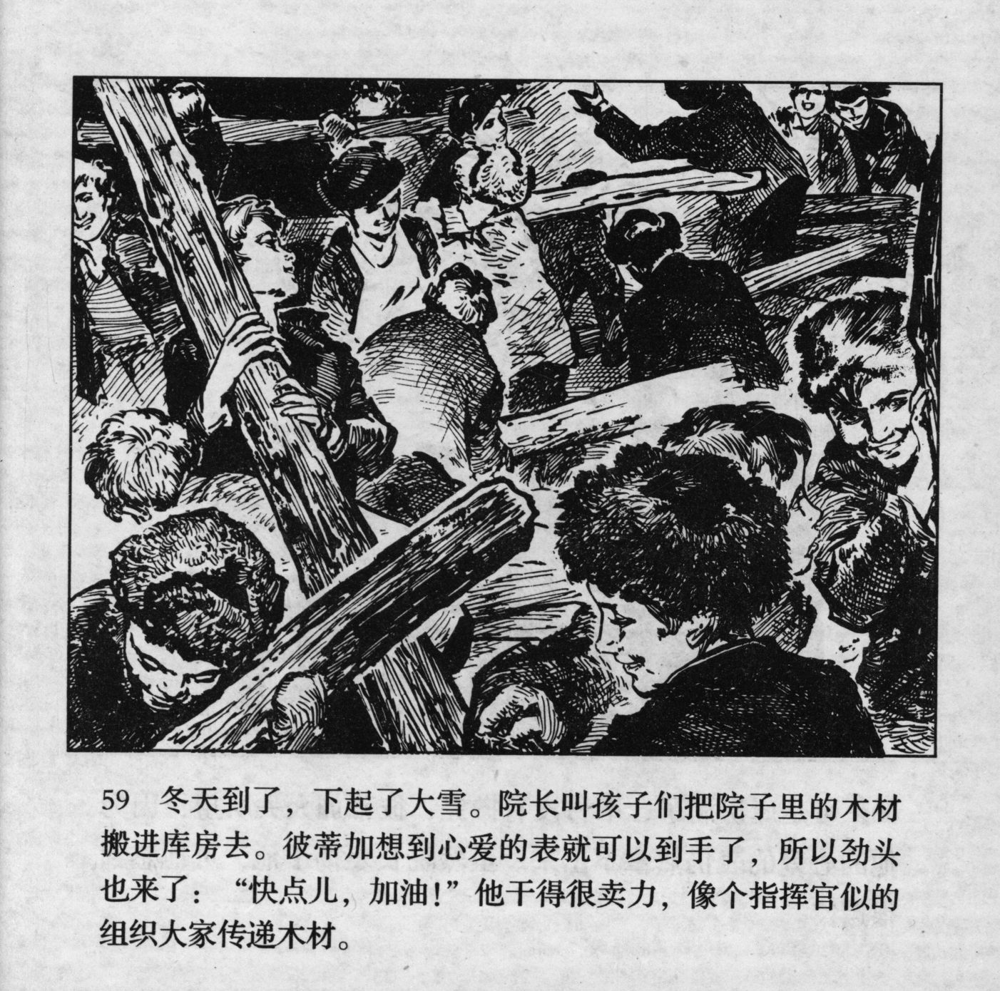



冬天到了，下起了大雪。院长叫孩子们把院子里的木材搬进库房去。彼蒂加想到心爱的表就可以到手了，所以劲头也来了：“快点儿，加油！”他干得很卖力，像个指挥官似的组织大家传递木材。

<--->

Winter came and heavy snow fell. The director called the children to carry the timber from inside the courtyard into the storehouse. Petka thought of how he could finally get his hands on his beloved watch, so he also joined with enthusiasm: "Move up, come on!" He threw himself into the task at hand and ordered everyone to pass the timber just like a commander.


