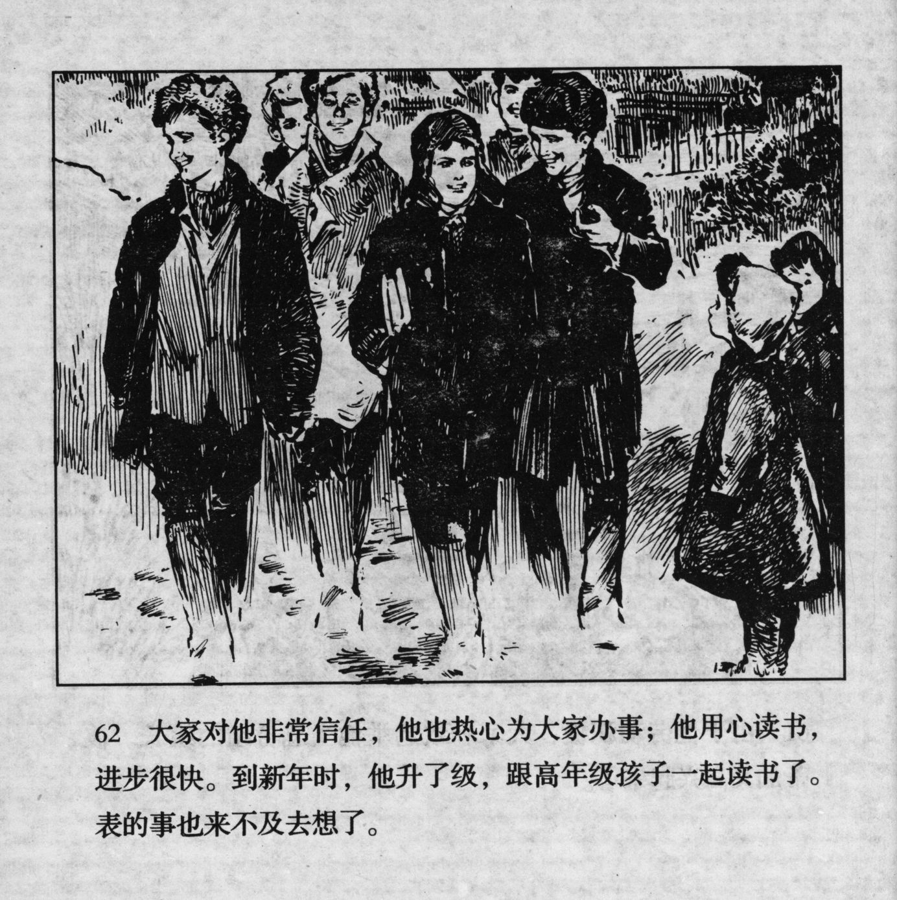



大家对他非常信任，他也热心为大家办事；他用心读书，进步很快。到新年时，他升了级，跟高年级孩子一起读书了。表的事也来不及去想了。

<--->

Everybody trusted him a lot, and he took care of all of their affairs with his full heart; he studied diligently and made good progress. When the new year started, he moved up to a higher class and studied together with the senior students. He did not have time to think about the matter of the watch anymore.


