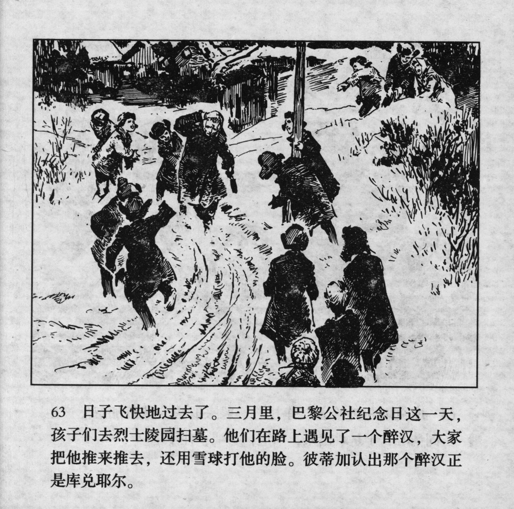



日子飞快地过去了。三月里，巴黎公社纪念日这一天，孩子们去烈士陵园扫墓。他们在路上遇见了一个醉汉，大家把他推来推去，还用雪球打他的脸。彼蒂加认出那个醉汉正是库兑耶尔。

<--->

The days were passing faster and faster. In March, on the Paris Commune Memorial Day, all the kids went out to sweep the tombs at the martyrs' cemetery. On their way, they came across a drunkard. Everyone rudely pushed and pulled him back and forth and even threw snowballs at his face. Petka recognized that this drunkard was Kudeyar.


