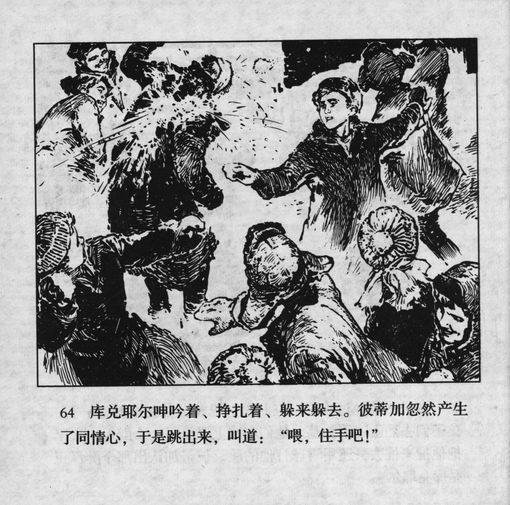



库兑耶尔呻吟着、挣扎着、躲来躲去。彼蒂加忽然产生了同情心，于是跳出来，叫道：“喂，住手吧！”

<--->

Kudeyar groaned, fought, and tried his best to duck away from the children. Petka suddenly felt sorry for him and so he jumped between them and shouted: "Hey, stop it!"


