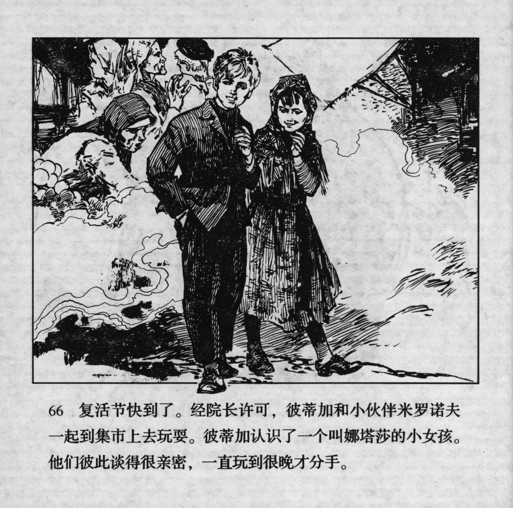



复活节快到了。经院长许可，彼蒂加和小伙伴米罗诺夫一起到集市上去玩耍。彼蒂加认识了一个叫娜塔莎的小女孩。他们彼此谈得很亲密，一直玩到很晚才分手。

<--->

Easter was near. The director allowed Petka to go out with his mate Milonov to spend some time at the market. There, Petka got to know a girl called Natasha. They started getting closer to each other and only separated when it was very late.


