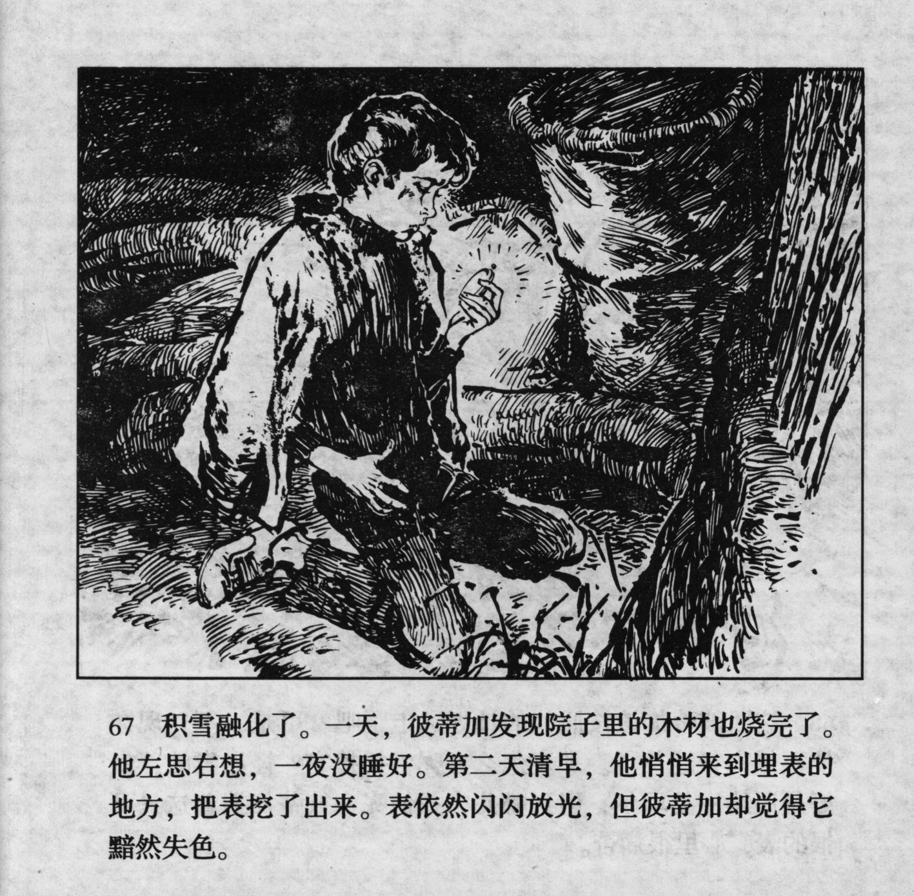



积雪融化了。一天，彼蒂加发现院子里的木材也烧完了。他左思右想，一夜没睡好。第二天清早，他悄悄来到埋表的地方，把表挖了出来。表依然闪闪放光，但彼蒂加却觉得它黯然失色。

<--->

The masses of snow had melted away. One day, Petka noticed that all the timber in the yard had been used up. He pondered and pondered, and he could not sleep the entire night. The next day, he secretly went to the place where he hid the watch and dug it out. It was still sparkling and glittering, but Petka had the feeling that it had lost its splendour.


