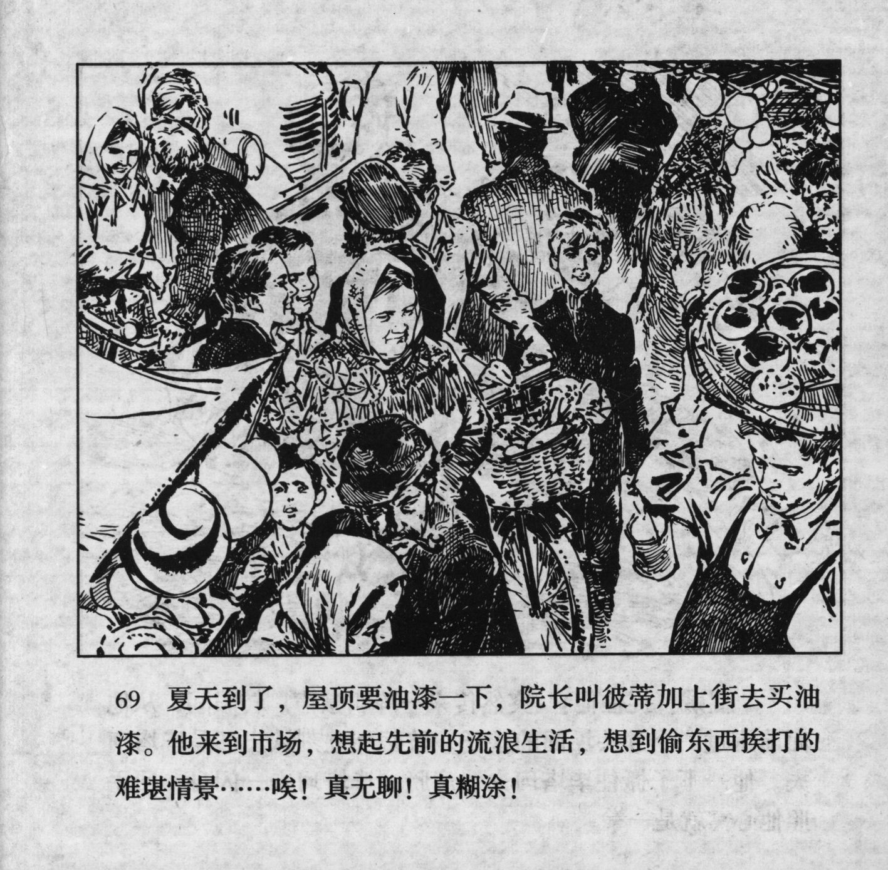



夏天到了，屋顶要油漆一下，院长叫彼蒂加上街去买油漆。他来到市场，想起先前的流浪生活，想到偷东西挨打的难堪情景……唉！真无聊！真糊涂！

<--->

Summer had arrived, and the roof needed to be painted. The director asked Petka to go shopping for paint. When he came to the market, he thought of his previous vagrant life and the embarrassment of stealing and being beaten up... UGH! What a bore! How confusing!


