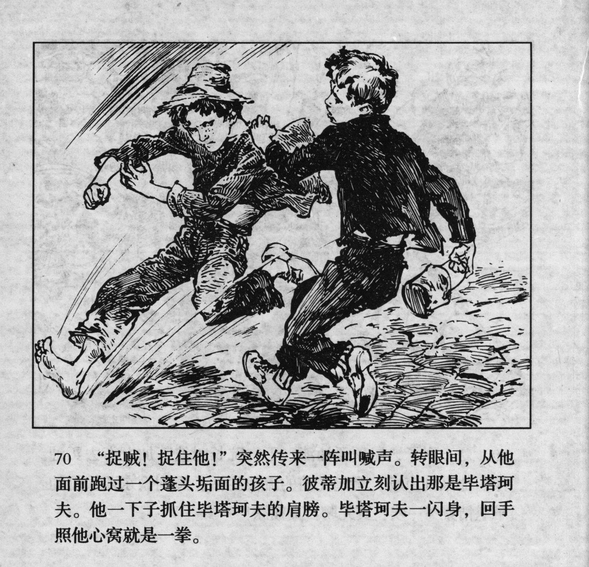



“捉贼！捉住他！”突然传来一阵叫喊声。转眼间，从他面前跑过一个蓬头垢面的孩子。彼蒂加立刻认出那是毕塔珂夫。他一下子抓住毕塔珂夫的肩膀。毕塔珂夫一闪身，回手照他心窝就是一拳。

<--->

"Catch the thief! Catch him!" Suddenly there was shouting. In the blink of an eye, an unkempt child ran past him. Petka immediately recognized that it was Pyatakov. He grabbed Pyatakov's shoulder at once. Pyatakov flinched, and then gave him a punch in the gut.


