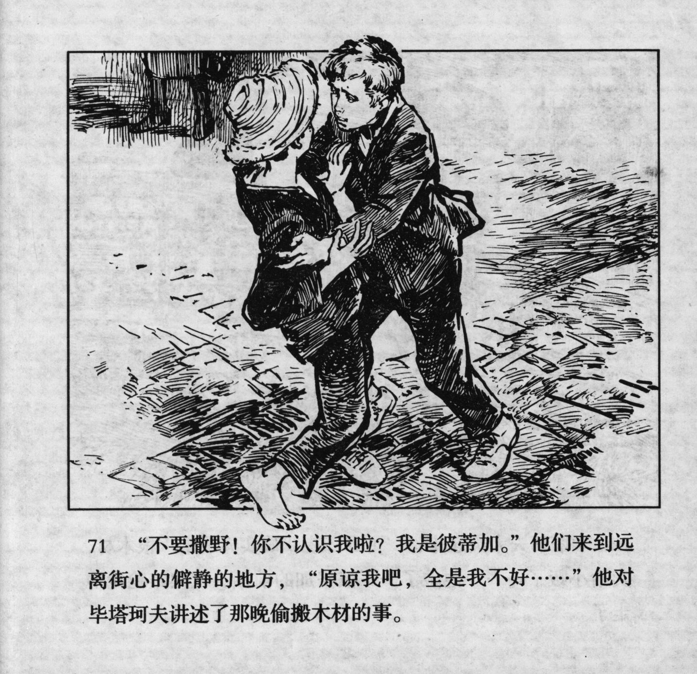



“不要撒野！你不认识我啦！我是彼蒂加。”他们来到远离街心的僻静的地方，“原谅我吧，全是我不好……”他对毕塔珂夫讲述了那晚偷搬木材的事。

<--->

"Don't be wild! Don't you know me? I'm Petka!" They came to a secluded place, away from the middle of the street, "forgive me, it\'s all my fault...," he told Pyatakov about the matter of stealing the wood that night.


