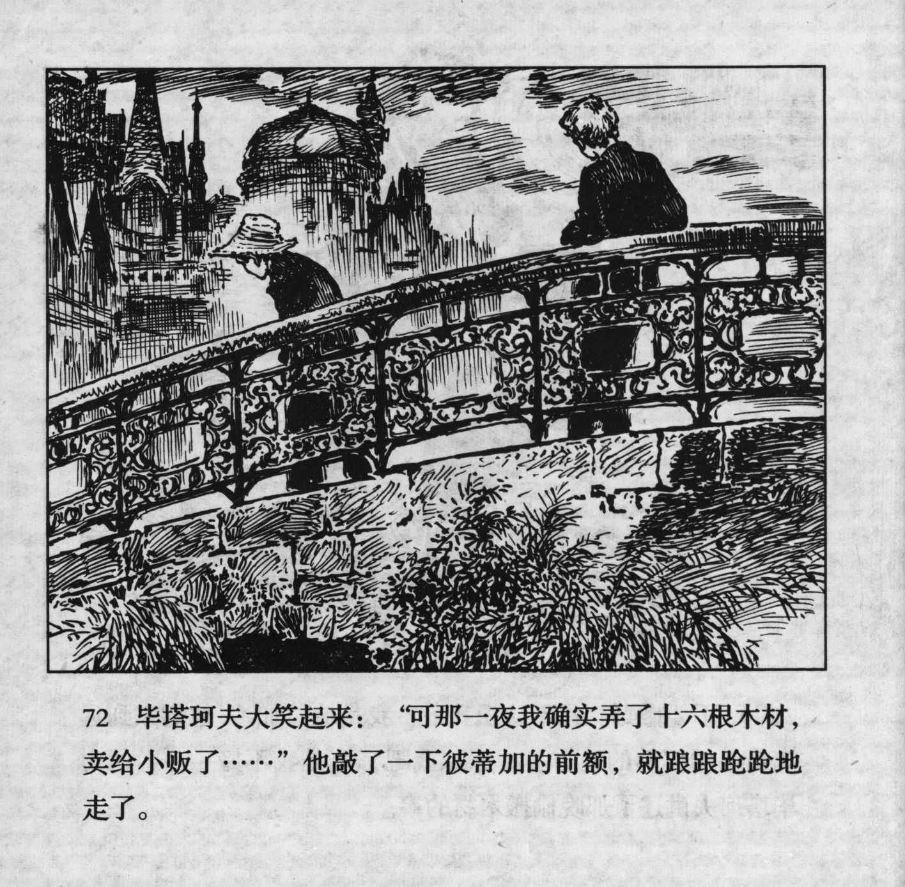



毕塔珂夫大笑起来：“可那一夜我确实弄了十六根木材，卖给小贩了……”他敲了一下彼蒂加的前额，就踉踉跄跄地走了。

<--->

Pyatakov started laughing: "But I did get 16 pieces of lumber that night, and sold that to a black-market handler..." he hit Petka on the forehead and staggered away.


