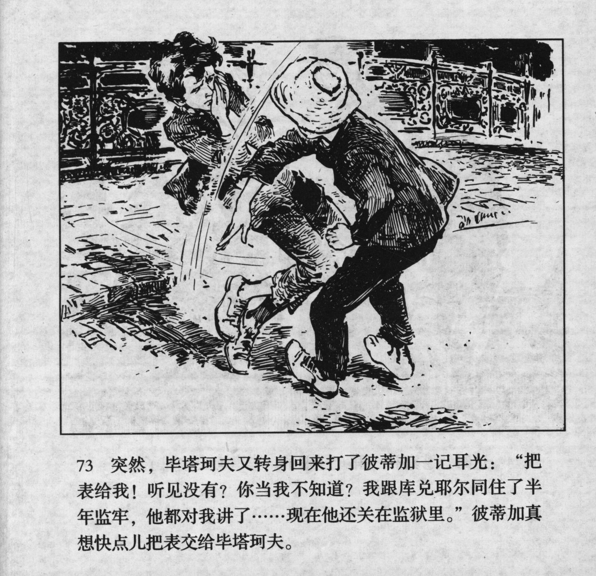



突然，毕塔珂夫又转身回来打了彼蒂加一记耳光：“把表给我！听见没有？你当我不知道？我跟库兑耶尔同住了半年监牢，他都对我讲了……现在他还关在监狱里。”彼蒂加真想快点儿把表交给毕塔珂夫。

<--->

Suddenly, Pyatakov turned around and slapped Petka into the face: "Give me the watch! Did you hear that? You think I don't know? I spent half a year in jail with Kudeyar, and he told me everything... he is still locked up in jail." Petka really wanted to give the watch to Pyatakov quickly.


