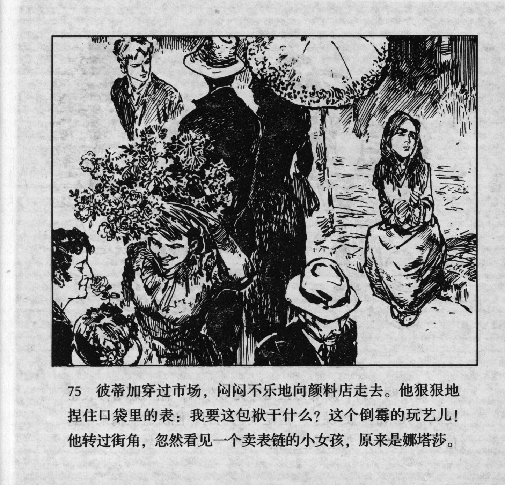



彼蒂加穿过市场，闷闷不乐地向颜料店走去。他狠狠地捏住口袋里的表：我要这包袱干什么？这个倒霉的玩艺儿！他转过街角，忽然看见一个卖表链的小女孩，原来是娜塔莎。

<--->

Petka crossed the market and walked to the paint shop gloomily. He squeezed the watch in his pocket fiercely: What do I want this burden for? This hapless game! As he turned around the corner of the street, he suddenly saw a girl selling a watch chain. The girl turned out to be Natasha.


