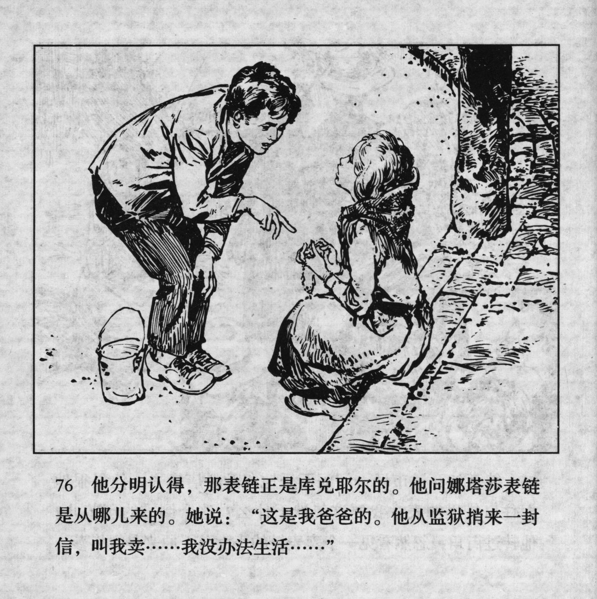



他分明认得，那表链正是库兑耶尔的。他问娜塔莎表链是从哪儿来的。她说：“这是我爸爸的。他从监狱捎来一封信，叫我卖……我没办法生活……”

<--->

He clearly recognized that the watch chain belonged to Kudeyar. He asked Natasha where the watch chain came from. She said: "This is my father\'s. He sent a letter from prison asking me to sell it… I can't live like this…"


