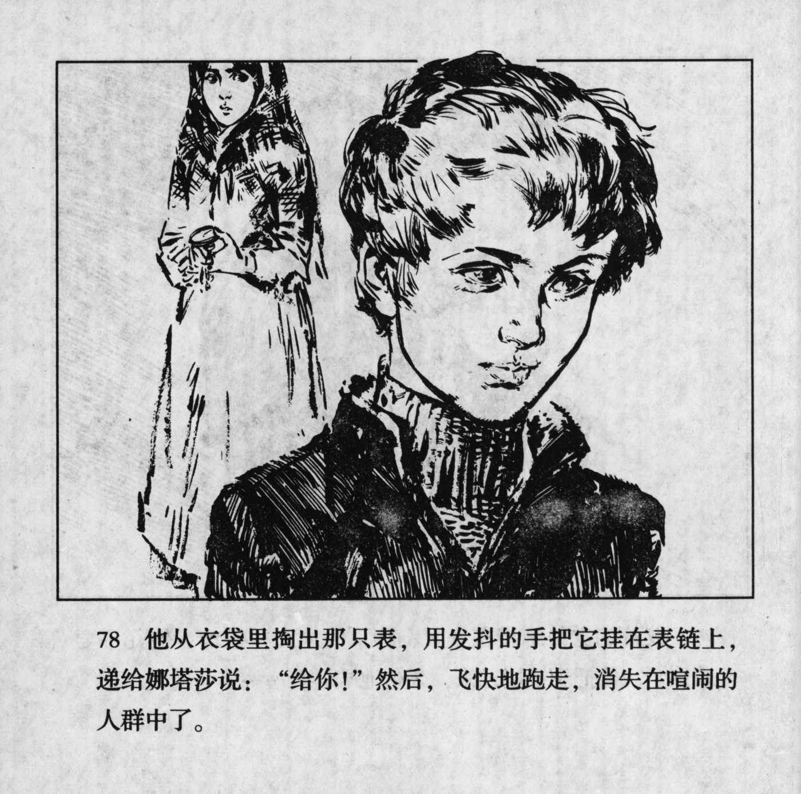



他从衣袋里掏出那只表，用发抖的手把它挂在表链上，递给娜塔莎说：“给你！”然后，飞快地跑走，消失在喧闹的人群中了。

<--->

He took the watch out of his pocket, attached it to the watch chain with trembling hands and handed it to Natasha: "Here, for you!" Then he ran away quickly and disappeared into the noisy crowd.


