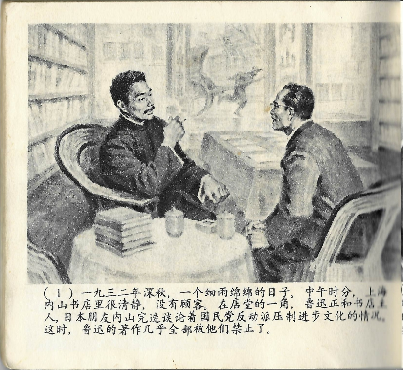



一九三二年深秋，一个细雨绵绵的日子。中午时分，上海内山书店里很清静，没有顾客。在店堂的一角，鲁迅正和书店主人，日本朋友内山完造谈论着国民党反动派压制进步文化的情况。这时，鲁迅的著作几乎全部被他们禁止了。

<--->

Es war ein vernieselter Tag im Spätherbst des Jahres 1932. Um die Mittagszeit war es in der Uchiyama-Buchhandlung in Shanghai ganz ruhig, es waren keine Kunden da. In einer Ecke des Ladens unterhielt sich Lu Xun mit dem Ladenbesitzer, seinem japanischen Freund Kanzō Uchiyama, darüber, wie die fortschrittliche Kultur durch die Reaktionäre der Guomindang unterdrückt wurde. Zu jener Zeit hatten diese nahezu sämtliche literarischen Schriften von Lu Xun verboten.

