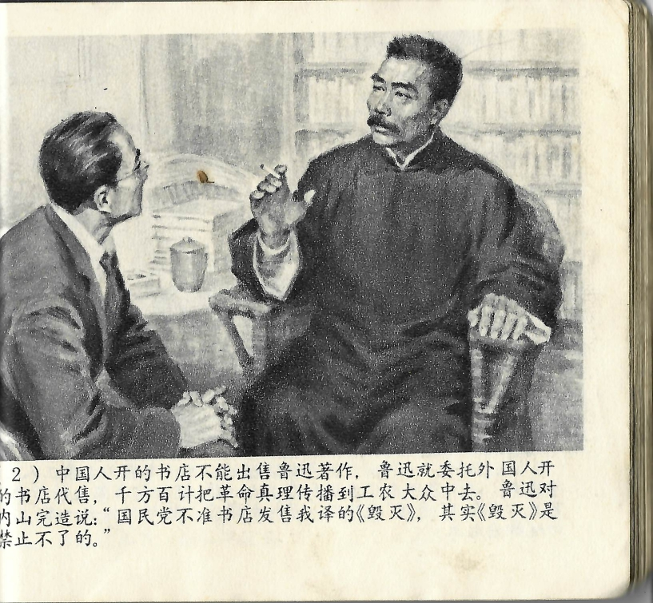



中国人开的书店不能出售鲁迅著作，鲁迅就委托外国人开的书店代售，千方百计把革命真理传播到工农大众中去。鲁迅对内山完造说：“国民党不准书店发售我译的《毁灭》，其实《毁灭》是禁止不了的。”

<--->

Von Chinesen betriebene Buchhandlungen durften Lu Xuns Werke nicht verkaufen, so dass er den Vertrieb seiner Bücher einer von einem Ausländer geführten Buchhandlung anvertraute, um die Wahrheit der Revolution mit allen Mitteln unter den Massen der Arbeiter und Bauern zu verbreiten. Lu Xun sagte zu Uchiyama Kanzō: „Die Guomindang erlaubt es Buchhandlungen nicht, das von mir übersetzte Werk *Die Neunzehn* zu verkaufen, doch *Die Neunzehn* lässt sich nicht verbieten."

