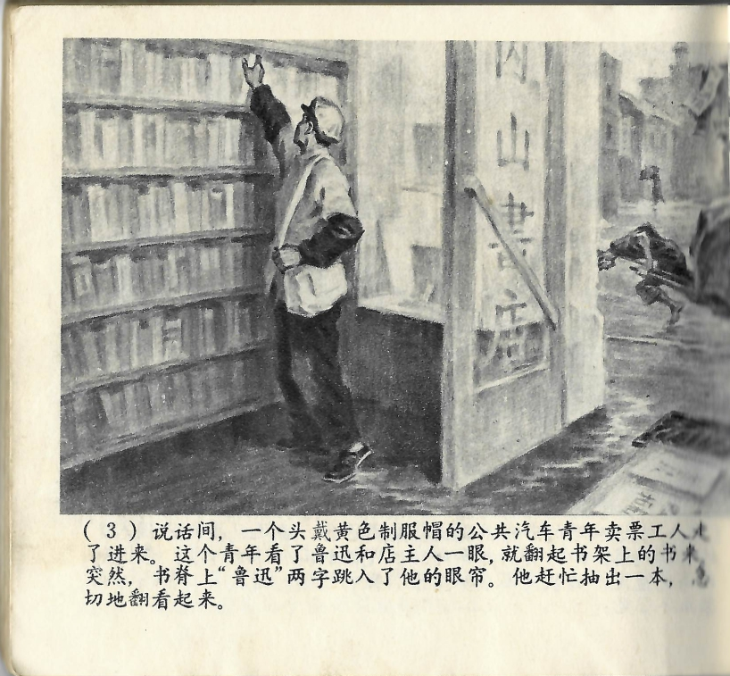



说话间，一个头戴黄色制服帽的公共汽车青年卖票工人走了进来。这个青年看了鲁迅和店主人一眼，就翻起书架上的书来。突然，书脊上“鲁迅”两字跳入了他的眼帘。他赶忙抽出一本，急切地翻看起来。
<--->

Während sie sich unterhielten, trat ein junger Verkäufer von Busfahrkarten mit gelber Uniformmütze auf dem Kopf herein. Der junge Mann warf Lu Xun und dem Ladenbesitzer einen kurzen Blick zu, bevor er anfing, sich die Bücher in den Regalen anzuschauen. Plötzlich sprang ihm der Name „Lu Xun" von einigen Buchrücken ins Auge. Sofort zog er ein Buch heraus und fing an, ungeduldig darin zu blättern.

